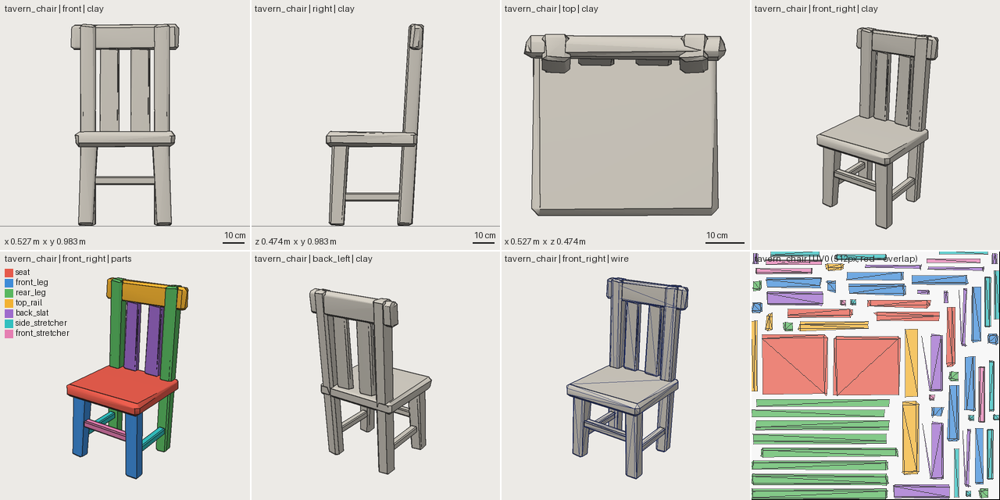

# Shapewright

**A 3D modelling environment whose primary user is an autonomous coding agent.**

Traditional 3D tools are built for eyes and hands: viewports, gizmos, selection,
shortcuts. Coding agents are good at other things: editing structured text,
reasoning over names, running commands, reading reports, looking at images,
using version control and repeating feedback loops. Shapewright is built for
those strengths. An asset is a small, diffable source file of **named parts,
parameters and constraints**. Deterministic tools turn it into geometry,
**validate** it in layers, **render** reproducible inspection images and
**export** a game-ready GLB. The agent iterates on the source the way it
iterates on code.



*`sw review tavern_chair`: one image with orthographic views and scale bars,
3/4 views, semantic part colours, wireframe density and the UV atlas. A vision
model can critique proportions from this and a human can review it at a glance.*

## What using it looks like

```text
User:  Create a chunky stylized medieval tavern chair, under 700 triangles, for mobile.
       Inspect and improve your own work, then export it.

Agent: reads AGENTS.md, runs `sw caps`, looks at assets/ for similar assets
       writes assets/tavern_chair/asset.yaml       (parts, params, checks)
       sw review tavern_chair                      -> PASS, sheet.png
       looks at sheet: "reads as a modern kitchen chair: legs spindly, no stretchers"
       sw snapshot -m "blockout" --critique "leg 0.045 -> 0.07, add stretchers, ..."
       edits params and parts                      -> sw review
       validators catch "front legs sink 1 cm below ground" -> fixes the anchor
       sw compare tavern_chair 1 current           -> side-by-side + silhouette diff
       sw export tavern_chair                      -> GLB passes Khronos validation and re-import
       reports: 484/700 tris, 0.53 x 0.98 x 0.47 m, 2 materials, PASS
```

That session is real: see `assets/tavern_chair/history/` for both iterations
and their critiques, and `docs/images/tavern_chair_compare_1_2.png` for the diff.

## Quick start

```bash
pip install -r requirements.txt   # pure-Python wheels; no GPU, no display, no Blender
./sw doctor                       # check the environment
./sw caps                         # modelling vocabulary, views, validators, profiles
./sw review tavern_chair          # validate + contact sheet + critique checklist
./sw render tavern_chair --part back_slat --view front
./sw export tavern_chair          # -> assets/tavern_chair/export/tavern_chair.glb
python3 -m pytest -q              # 80+ tests: shapes, ops, validators, determinism, golden geometry
```

Optional: `cd tools/gltf-validator && npm install` enables the Khronos glTF-Validator in `sw export`.

## An asset source, abridged

```yaml
profile: mobile_mid            # production budgets
style: stylized_lowpoly        # art direction the agent reviews against
budget: {triangles: 700}
params:
  seat_height: {value: 0.46, min: 0.40, max: 0.50}
  leg: 0.07
  lean: 0.06
parts:
  seat:
    shape: {type: chamfer_box, size: [seat_width, seat_thickness, seat_depth], chamfer: 0.016}
    anchor: top
    position: [0, seat_height, 0]
  rear_leg:
    shape: {type: chamfer_box, size: [leg, back_height, leg], chamfer: 0.01}
    ops: [{type: shear, axis: y, toward: z, amount: -lean}, {type: jitter, amount: wear, seed: 3}]
    anchor: bottom_front
    position: [leg_x, 0, post_z + leg / 2]
    mirror: x                  # -> rear_leg_left, rear_leg_right
checks:                        # design intent as tests
  - {expr: seat.max.y, min: 0.42, max: 0.50}
  - {expr: top_rail.size.x / seat.size.x, min: 0.8, max: 1.15}
```

"The backrest is too narrow" maps to one parameter, not to vertex indices. The
part names survive into the GLB as node names.

## What exists today (v0.1 vertical slice)

| Area | Implemented |
|---|---|
| Representation | declarative YAML sources; params with safe expressions; semantic parts; anchors/attach placement; mirror, linear and radial arrays; `extends` inheritance (asset families); seeded `variants` |
| Geometry | box, chamfer_box, cylinder/cone/frustum, sphere, icosphere, capsule, torus, ring, lathe, revolve, extrude (with holes and taper), tube sweep, random_hull |
| Ops | taper, bend, twist, shear, jitter, noise, inflate, subdivide, smooth, decimate, boolean subtract/union/intersect (Manifold), flat_bottom, transforms |
| Surface | flat, smooth and auto-smooth normals; single-atlas UV unwrap and packing (xatlas); PBR materials |
| Validation | source, geometry, assembly, budget, intent, surface, style and export layers; 40+ stable issue codes with hints |
| Inspection | deterministic CPU renderer; 11 views; clay, parts, material, wire, normals and silhouette modes; part focus and isolation; UV view; contact sheets |
| Iteration | snapshots with critiques, log, compare (image + metrics), restore |
| Export | deterministic GLB with named part nodes, hierarchy, pivots, sockets, collision proxies (UCX or Godot naming) and metadata extras; Khronos validation plus re-import round-trip |
| Benchmarks | tavern_chair, tavern_stool (inherits from the chair), tavern_table, barrel, crate, rock, street_lamp |

## Documentation

| Read | For |
|---|---|
| [AGENTS.md](AGENTS.md) | operating manual for agents (start here if you are one) |
| [docs/VISION.md](docs/VISION.md) | what this is, what it is not, the design principles |
| [docs/ARCHITECTURE.md](docs/ARCHITECTURE.md) | the design and why: representation, kernel, validation, rendering, security |
| [docs/ASSET_FORMAT.md](docs/ASSET_FORMAT.md) | the asset source specification |
| [docs/AGENT_WORKFLOW.md](docs/AGENT_WORKFLOW.md) | the closed loop in detail, critique format, stopping rules, recovery |
| [docs/VALIDATION.md](docs/VALIDATION.md) | every validation layer and issue code |
| [docs/MODELING_CAPABILITY_MAP.md](docs/MODELING_CAPABILITY_MAP.md) | taxonomy of 3D capabilities and their planned coverage |
| [docs/RESEARCH.md](docs/RESEARCH.md) | prior art, libraries evaluated, licences, risks |
| [docs/ROADMAP.md](docs/ROADMAP.md) | stages and success criteria |
| [CONTRIBUTING.md](CONTRIBUTING.md) | adding shapes, ops, validators, views, profiles, exporters |

## Licence

Apache-2.0. All runtime dependencies are permissively licensed (BSD, MIT,
Apache-2.0, MIT-CMU); see [docs/RESEARCH.md](docs/RESEARCH.md#licences).
