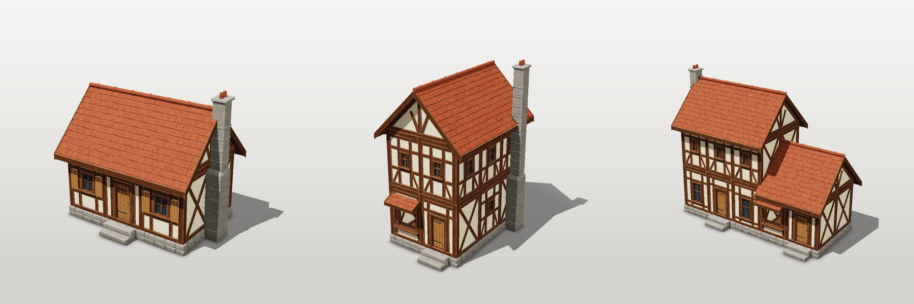
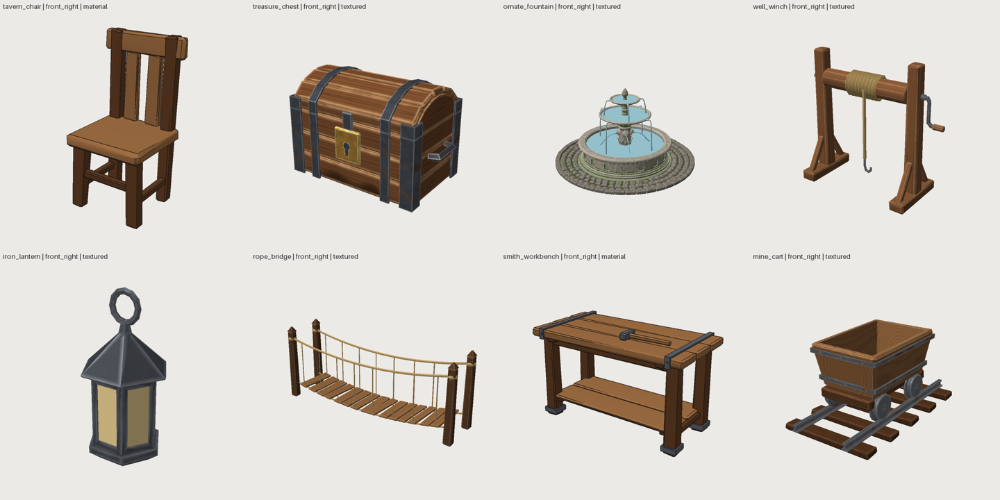
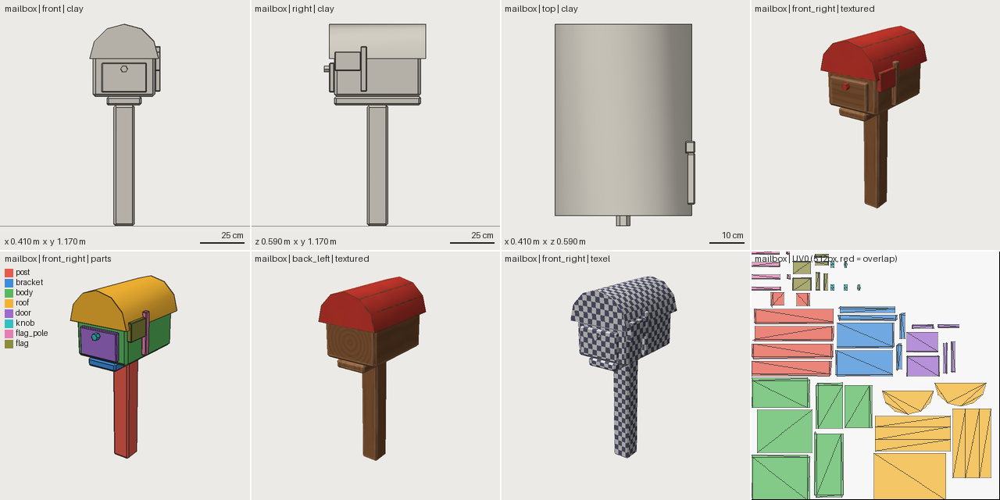

# Shapewright

**3D game assets written like code, built by AI agents, checked like code.**

[](https://github.com/billtruong003/ShapeWright/actions/workflows/ci.yml)
[](https://billtruong003.github.io/ShapeWright/)

[](LICENSE)

[Documentation](https://billtruong003.github.io/ShapeWright/) ·
[Quickstart](https://billtruong003.github.io/ShapeWright/quickstart/) ·
[Gallery](https://billtruong003.github.io/ShapeWright/gallery/) ·
[`llms.txt`](llms.txt) ·
[MCP server](docs/MCP.md) ·
[Roadmap](docs/PHASE_PLAN_16.md) ·
[Changelog](CHANGELOG.md)



*Three houses built from one modular kit (26 modules, 1 pack, 7 shared materials). An agent wrote every piece as source. The seams are validated, and all three rebuild when the grid, storey height, timber size or roof pitch changes.*

An asset is a short YAML file of **named parts, parameters and design checks**. Shapewright turns it into a mesh, **validates** it in 8 layers, **renders** inspection sheets that the agent looks at, and **exports** a game-ready GLB for Godot, Unity, Unreal or the web. It needs no GPU, no display and no Blender, and the same source always gives the same bytes.



---

## Install

```bash
# as a package (library of examples included)
pip install "git+https://github.com/billtruong003/ShapeWright"
pip install "shapewright[mcp] @ git+https://github.com/billtruong003/ShapeWright"   # + MCP server

# or from a clone (development)
git clone https://github.com/billtruong003/ShapeWright && cd ShapeWright
pip install -r requirements.txt && ./sw doctor
```

Python 3.10+. Every runtime dependency is a permissively licensed wheel. Optional: `cd tools/gltf-validator && npm install` for the Khronos glTF validator during export.

## First asset in five minutes

```bash
sw init my_assets && cd my_assets            # a project folder; library examples stay usable by name
sw brief "a chunky wooden barrel for a mobile game, under 800 triangles"
sw new my_barrel --from barrel               # start from the closest example
sw review my_barrel                          # validation + contact sheet: assets/my_barrel/.build/sheet.png
sw set my_barrel height=0.93                 # change a param in the source (comments kept)
sw export my_barrel --target godot           # -> assets/my_barrel/export/my_barrel_godot.glb (+ report)
```



*`sw review`: orthographic views with scale bars, 3/4 views, part colours, texel density and the UV layout. This sheet is from a fresh agent's first session, working from nothing but `pip install` and `llms.txt` (12 tool calls, 308/850 triangles, every layer PASS).*

## Use it from your agent

| Where you work | How | Guide |
|---|---|---|
| **Claude Code** (cloud or local) | clone the repo: `CLAUDE.md` → `AGENTS.md` and the `.claude/skills/shapewright` skill load automatically | [cloud](https://billtruong003.github.io/ShapeWright/quickstart/claude-code-cloud/) · [local](https://billtruong003.github.io/ShapeWright/quickstart/claude-code-local/) |
| **Claude Desktop, Cursor, Codex, any MCP client** | `sw mcp`: 18 tools; review, render and workbench feedback return **images** | [MCP clients](https://billtruong003.github.io/ShapeWright/quickstart/mcp-clients/) · [docs/MCP.md](docs/MCP.md) |
| **ChatGPT or any chat** | paste [`llms.txt`](llms.txt) (one page, generated from the code) | [chat](https://billtruong003.github.io/ShapeWright/quickstart/chat/) |
| **People** | the CLI, or `sw workbench --open` (a local page where every button runs an `sw` command) | [by hand](https://billtruong003.github.io/ShapeWright/quickstart/cli/) |
| **Docker** | `docker build -t shapewright .` then `docker run --rm -v "$PWD:/work" shapewright brief "..."` | [Dockerfile](Dockerfile) |

## What it can do

| Area | Features | Read |
|---|---|---|
| **Modelling** | 17 shapes (chamfer_box, extrude with holes, lathe, tube sweep, strut, random_hull, …); 20 ops (booleans, bend, twist, taper, jitter, noise, subdivide, decimate, clean, …); arcs, helices and lines inside point lists | [vocabulary](https://billtruong003.github.io/ShapeWright/reference/vocabulary/) · [ASSET_FORMAT](docs/ASSET_FORMAT.md) |
| **Placement** | anchors and `attach`, `measure:` queries on real geometry (section, gap, bounds, anchor, ray), arrays with per-instance expressions, mirror, pivots | [RELATIONSHIPS](docs/RELATIONSHIPS.md) |
| **Reuse and kits** | components (they nest), **asset instances** (`asset: house_wall_window`), packs of shared params and materials, `extends` variants and families, seeded variants | [composition](https://billtruong003.github.io/ShapeWright/concepts/composition/) · [FAMILIES](docs/FAMILIES.md) |
| **Surfaces** | material archetypes (wood, stone, metal, painted, flat, authored) baked to base colour + ORM atlases; stable UVs (`uv.lock.yaml`) | [SURFACES](docs/SURFACES.md) · [UV](docs/UV.md) |
| **Validation** | 8 layers (source, geometry, assembly, budget, intent, surface, style, export) with stable issue codes and hints; **z-fighting between parts**, displacement that inverts faces, floating or contact-only parts | [codes](https://billtruong003.github.io/ShapeWright/reference/codes/) · [VALIDATION](docs/VALIDATION.md) |
| **Inspection** | deterministic CPU renderer, 11 views, 14 modes (clay, parts, textured, wire, texel, seams, …), contact sheets, iteration snapshots and compare images | [AGENT_WORKFLOW](docs/AGENT_WORKFLOW.md) |
| **Presentation** | `beauty` mode (key/fill/rim light, shadows, ambient occlusion, contact shadow, tone mapping), turntable GIF, presentation sheet, 1.75 m scale reference; CPU-only and deterministic | [Presentation renders](https://billtruong003.github.io/ShapeWright/use-cases/presentation/) |
| **Export** | GLB with named nodes, pivots, sockets, collision proxies and LODs; merge by material for draw calls; Godot, Unity and Unreal targets; 8 budget profiles (mobile, VR, web, desktop) | [PRODUCTION](docs/PRODUCTION.md) · [profiles](https://billtruong003.github.io/ShapeWright/reference/profiles/) |
| **Import** | GLB, OBJ, STL and PLY with materials and textures kept; `clean` repair; UV-preserving `decimate` | [IMPORT](docs/IMPORT.md) |
| **Agents** | `sw brief` (closest example + rules), `llms.txt`, MCP server, Claude Code skill, workbench for people | [AGENTS.md](AGENTS.md) |

## Tutorials (every command in them runs in the test suite)

- [A game prop in one session](https://billtruong003.github.io/ShapeWright/use-cases/prop/)
- [A modular kit and buildings made from it](https://billtruong003.github.io/ShapeWright/use-cases/modular-kit/)
- [One design, many variants](https://billtruong003.github.io/ShapeWright/use-cases/variants/)
- [Import and repair an existing model](https://billtruong003.github.io/ShapeWright/use-cases/import-repair/)
- [Tight budgets: VR, mobile, web](https://billtruong003.github.io/ShapeWright/use-cases/budgets/)
- [Assets in CI](https://billtruong003.github.io/ShapeWright/use-cases/ci/)

## An asset source, abridged

```yaml
profile: mobile_mid            # production budgets
style: stylized_lowpoly        # art direction the agent reviews against
budget: {triangles: 700}
params:
  seat_height: {value: 0.46, min: 0.40, max: 0.50}
  leg: 0.07
parts:
  seat:
    shape: {type: chamfer_box, size: [seat_width, seat_thickness, seat_depth], chamfer: 0.016}
    anchor: top
    position: [0, seat_height, 0]
  rear_leg:
    shape: {type: chamfer_box, size: [leg, back_height, leg], chamfer: 0.01}
    ops: [{type: shear, axis: y, toward: z, amount: -lean}, {type: jitter, amount: wear, seed: 3}]
    anchor: bottom_front
    position: [leg_x, 0, post_z + leg / 2]
    mirror: x                  # -> rear_leg_left, rear_leg_right
checks:                        # design intent as tests
  - {expr: seat.max.y, min: 0.42, max: 0.50}
```

"The backrest is too narrow" maps to one parameter, not to vertex indices. Part names survive into the GLB as node names.

## Shapewright or Blender MCP?

Use Blender for sculpting, rigging and hero renders. Use Shapewright when you need **sets of game-ready assets** that an agent can build, check and change reliably:
- a diffable source instead of a `.blend`;
- deterministic builds;
- validation with issue codes instead of screenshots only;
- packs and kits that stay consistent;
- headless runs in cloud and CI.

Characters (organic forms, rigging) are planned natively too, with no Blender dependency ([plan](docs/REMAINING_WORK.md)).

## How it was built and tested

Development runs in phases. Each phase has a plan written first, a gate, and an acceptance test run by a *fresh* agent or a real modelling task. Every result is recorded, including the partial ones:

- [docs/experiments/](docs/experiments/README.md): 10 fresh-agent experiments (FA-11 is recorded in Phase 16) and the [modular house kit acceptance test](docs/experiments/MODULAR_HOUSE_PACK_01.md)
- [docs/phases/](docs/phases/): Phases 16–20 (packaging, MCP, composition, seam validation, docs site)
- [docs/PHASE_PLAN_16.md](docs/PHASE_PLAN_16.md): what is next, and the run protocol

## Documentation map

| Read | For |
|---|---|
| [AGENTS.md](AGENTS.md) | the operating manual for agents (start here if you are one) |
| [llms.txt](llms.txt) | a one-page brief for any AI agent (`sw caps --llms`) |
| [docs/VISION.md](docs/VISION.md) · [ARCHITECTURE](docs/ARCHITECTURE.md) | what this is and why it is built this way |
| [docs/ASSET_FORMAT.md](docs/ASSET_FORMAT.md) | the source specification |
| [docs/AGENT_WORKFLOW.md](docs/AGENT_WORKFLOW.md) | the loop, critique format, stopping rules |
| [docs/VALIDATION.md](docs/VALIDATION.md) | every layer and issue code |
| [docs/MCP.md](docs/MCP.md) | the MCP server: tools, safety model, client setup |
| [docs/REMAINING_WORK.md](docs/REMAINING_WORK.md) | every remaining task with its plan, gate and the progress table (v1.0 ≈ 80 %) |
| [docs/HANDOFF.md](docs/HANDOFF.md) | how to continue development with an agent on your machine |
| [CONTRIBUTING.md](CONTRIBUTING.md) | adding shapes, ops, validators, views, profiles, exporters |

## Licence

Apache-2.0. All runtime dependencies are permissively licensed (BSD, MIT, Apache-2.0, MIT-CMU); see [docs/RESEARCH.md](docs/RESEARCH.md#licences).
