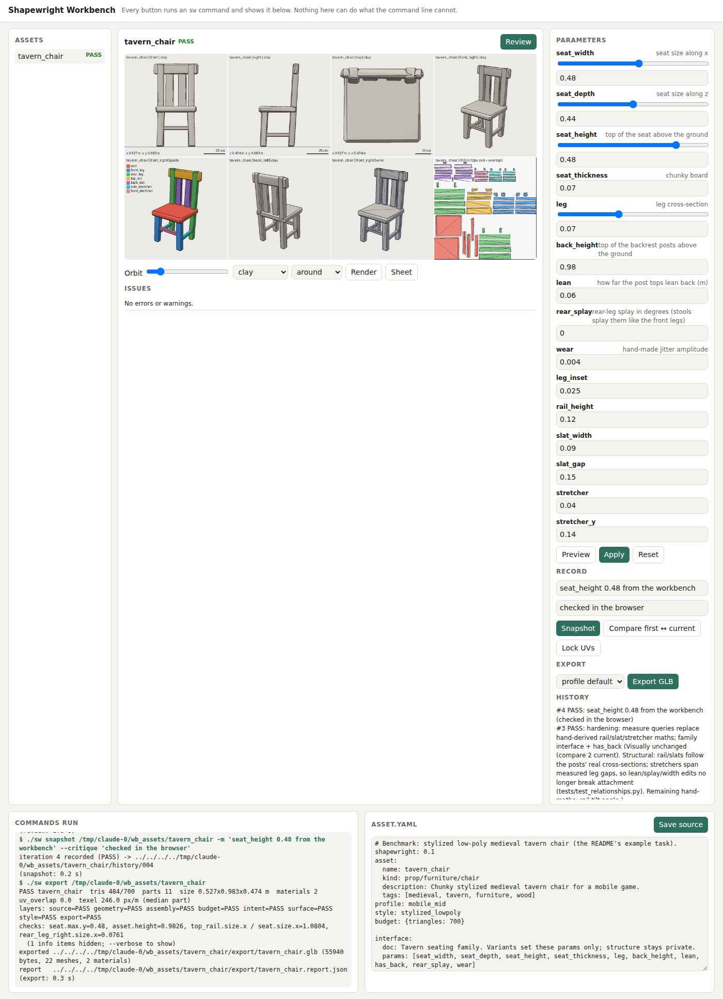

# Human workbench (Phase 15)

## Question

Can a person inspect, adjust, review, record and export an asset from a browser **through the same core
APIs the agent uses**, with **no modelling feature that exists only in the GUI**?

The failure this phase guards against is a second, human-only modelling path, for example a drag handle
that writes geometry the source cannot express. Such a path splits the product: agents could no longer
reproduce or review what people do.

## Research: what a person needs that the CLI already gives an agent

| Need | Agent today | Workbench |
|---|---|---|
| find assets | `ls assets/`, `sw brief` | list with status |
| see the asset from all sides | `sw review` sheet, `sw render --view V --mode M` | view × mode picker over `sw render` images; stepping round the 8 named views is the orbit |
| read problems | validation text | the same issues, with part and hint |
| try values without editing | `--set k=v` on review/render/stats/validate | parameter sliders with min/max from the source, previewed via `--set` |
| keep a value | edit asset.yaml | **new `sw set ASSET k=v`**: writes param values in the source, keeping comments. Agents get it too |
| edit structure | edit asset.yaml | a source editor (the file itself) |
| record / compare / roll back | `sw snapshot`, `sw log`, `sw compare`, `sw restore` | buttons for the same commands |
| export | `sw export [--target]` | a button, same command |

One thing is **missing for both**: keeping a parameter value without hand-editing YAML. It is added to the
CLI first (`sw set`), and the workbench uses it. Nothing is added to the workbench alone.

## Design

- **`sw workbench [--port 8765]`** starts a local server (Python standard library `http.server`, no new
  dependency). It binds to **127.0.0.1 only**.
- **Every action is an `sw` command line**, run in-process through `cli.main(argv)`:
  - the server holds a whitelist of commands and builds argv from structured requests;
  - each response echoes the equivalent command (`./sw review barrel --set staves=12`);
  - no geometry, validation or export code is imported by the workbench module (architecture test).
- **Reads.** The workbench reads files: `asset.yaml`, `.build/*.png` and `report.json` from the asset folder.
  Paths are sandboxed to `assets/`.
- **Writes.** There are only two:
  - `sw set` (params);
  - saving the source text. The text is validated by building it; if the build fails with a source error,
    the previous text is restored.
- **UI.** One static HTML page, no external scripts (three.js is vendored, Phase 15b). It works offline and holds no business logic:
  - asset list;
  - image panel (view/mode, sheet);
  - issues;
  - parameter sliders (preview/apply);
  - source editor;
  - history;
  - export.

## Gate

1. **Parity:** every workbench action maps to an `sw` command, and the result equals running that command
   from the CLI (report, history, export bytes). This is tested.
2. **No GUI-only modelling:** the workbench module imports only `cli` (and the standard library). It is
   tested in `test_architecture.py`.
3. **A scripted human session** in a real browser (Chromium via Playwright) must succeed with no
   manual step, and the resulting files must be identical to the same session done with CLI commands:
   - open an asset;
   - move a slider;
   - preview;
   - apply;
   - review;
   - snapshot;
   - export.

## Predictions

| # | Prediction |
|---|---|
| W1 | Parity holds by construction (in-process `cli.main`). The risk is concurrency: two requests at once must not interleave (a lock serialises runs) |
| W2 | `sw set` must preserve comments and formatting, since sources are hand-authored. Mapping-form params (`{value: 3, min: ...}`) are the tricky case |
| W3 | The 8 named views as an orbit are enough to judge form; a real-time 3D viewer is not needed for the gate, and its absence is stated |
| W4 | A person needs the same review sheet an agent sees; no new render mode is needed |

## Phase 15b: the 3D view and notes for the agent

The image panel became a **3D view** (three.js r169, vendored under `shapewright/workbench/vendor/`, MIT; loaded
with an import map, so the page still works offline and needs no build step). It shows the GLB of
`sw export ASSET --preview --target generic` (per-part nodes, no collision proxies), rebuilt after Preview/Apply.

- **View modes** (materials swapped in the browser, no rebuild): textured, clay, material colours, colour by part,
  normals, UV checker (stretching and flipped charts show), texel density (blue = half the median px/m, red = double);
  wireframe overlay, 1 m grid, a 1.75 m figure; **UV layout** of the picked part (zoomed to its charts) or of all parts.
- **Model list**: thumbnails (the newest beauty/textured render or the sheet), status, triangles, build time; search
  and a status filter.
- **Export**: a download link for the GLB just written. **Screenshot** saves the 3D view to `.build/shots/`.
- **Notes for the agent**: click the model to pick a part (name, point in asset coordinates, surface normal), type
  what is wrong, *Pin note*. The page saves a screenshot with the spot marked and runs `sw feedback ASSET add ...`.
  The agent reads open notes with `sw feedback ASSET` or the MCP tool `feedback` (text + screenshots), fixes the
  source and runs `sw feedback ASSET resolve ID --reply "..."`; the page shows the reply.

The rules above still hold: the 3D view is for people (the CPU renderer stays the reference for agents, tests and
goldens), the browser never edits geometry, and every action is an `sw` command (screenshots are the one extra write,
under `.build/shots/`).

## Result: gate PASS (by construction and by test); human usability not yet tested with people

Built:
- `sw set` (CLI first; agents can use it too);
- `sw workbench [--port] [--assets DIR] [--open]`: `shapewright/workbench/server.py` and one static
  `index.html`, standard library only.

| Gate item | Evidence |
|---|---|
| 1 parity | `tests/test_workbench.py::test_http_session_equals_the_same_cli_session`: preview → set → review → snapshot → export through HTTP, then the same through `sw` commands. `asset.yaml` text is identical, the snapshot summary is identical (source hash, metrics, status, note) and the **GLB bytes are identical**. A source that stops building is restored |
| 2 no GUI-only modelling | `test_workbench_imports_nothing_but_the_cli`: the server imports `..cli`, `yaml` and the standard library, nothing else. The command whitelist is the page's entire capability surface (`test_argv_whitelist`, which also rejects path traversal and injected view names) |
| 3 scripted human session | `test_browser_session`: Chromium via `tools/workbench/session.mjs` clicks through asset → parameter → Preview → Apply → Snapshot → Export. The page's command log shows the 5 `sw` commands, and the files equal the CLI session's. Runs when `cd tools/workbench && npm install` has been done |

| Prediction | Outcome |
|---|---|
| W1 parity by construction; concurrency is the risk | ✔ Requests run on the main thread one at a time. A **real bug** surfaced: `cli.main` left its `SIGALRM` timeout armed after returning. That is harmless in a one-shot CLI, but it would have killed a long-running server later. `cli.main` now cancels it, and the `workbench` command itself runs without one |
| W2 `sw set` must keep comments and layout | ✔ scalar, flow-mapping and block-mapping params. Inline comments and their spacing are kept; the rest of the file is byte-identical (tested). It refuses values outside min/max, and restores the file if the new value does not build |
| W3 8 named views are enough as an orbit | ✔ for the scripted session. **Not verified with people**: a real-time 3D viewer is absent by design (no external scripts, no GUI-only logic) |
| W4 same sheet as the agent | ✔ the review sheet is the default image |

**Honest limits.**
- No person has used it yet. The gate is structural parity plus a scripted browser session, not a usability
  study.
- The source editor is a plain text area.
- Viewing is by rendered images (views × modes), not a live 3D viewport.
