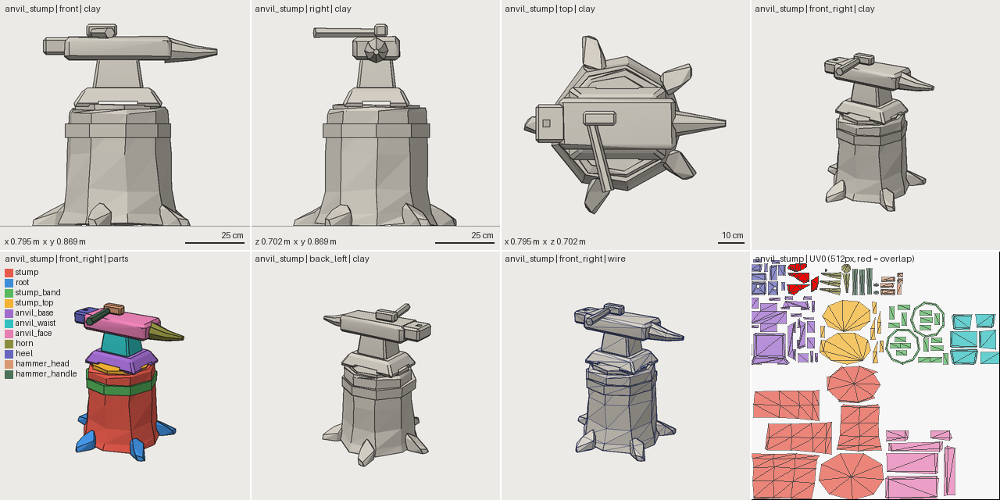

# Fresh-agent experiment 01: anvil on a stump

- **Date:** 2026-09-29
- **Repository state:** commit `61569b2` (after architecture hardening), cloned into an isolated directory
- **Agent:** a newly spawned coding agent with no project context (same model family as the authors)
- **Artifact:** `assets/anvil_stump/` (source, 4-iteration history, `uv.lock.yaml`, export)

## Prompt (verbatim task part)

> Use this repository to create: "A stylized low-poly blacksmith's anvil standing on a wooden tree stump,
> for a mobile game. Requirements: game-ready; under 900 triangles; clean UVs; chunky stylized proportions;
> inspect your own result; fix technical problems; improve the visual design until satisfied; export the
> final asset." Figure out how to do this from the repository itself.

The agent was also asked to append an experiment report (commands, failures, use of images, confusion
points). That request gave no workflow hints.

## Observed (verified against files)

| | |
|---|---|
| Wall clock | 542 s (~9 min) |
| Tool calls / tokens | 65 / ~150k |
| `sw` commands | 61 (doctor, caps, 8× doc, new, ~20 review, 7 stats, 8 render, 4 snapshot, compare, uv lock, validate, export, log) |
| Human interventions | 0 |
| Snapshots | 4: blockout 310 tris → chunky revision 630 → materials/polish 680 → hull-lump roots 720 |
| Validation | never FAIL; 2 warnings resolved (UV_TEXEL_DENSITY on the band, STYLE_THIN_FEATURE on the end-grain cap) |
| Final | PASS on all layers; 720/900 tris; 3 materials (budget raised in source, justified in the report) |

## Critique quality (from `sw log anvil_stump`)

Critiques were specific and quantified, for example: *"Stump reads as a bell/pot: too wide (0.64) and short
(0.42)… horn: thin needle, centred on the face instead of flush with its top -> radius 0.05, top-aligned."*
The stopping reason was stated: *"validation PASS, last critique clean, constraints met."*

## Features used

`attach` (8 parts), `array` (roots), `lathe` (stump), `tube` (hammer handle), `random_hull` (roots),
`subtract` (3: foot notch, hardy hole), `uv: {share_instances, seams}`, `checks` (4, including a boolean
`horn.max.y <= anvil_face.max.y + 0.005`), `sw uv lock`, `sw compare`.
**Not used:** `measure`, components, `boolean`/`combine` expressions, `enabled`, `mesh_file`.

## Friction reported → action

| Report | Action |
|---|---|
| `review` suggests `--verbose` but rejects it | fixed |
| rotation direction undocumented (guessed wrong once) | documented with the right-hand rule and an example (verified numerically) |
| UV tile paints shared-instance UVs red while the metric says 0 overlap | fixed (the tile draws one representative per shared owner) |
| `UV_TEXEL_DENSITY` hint mentions re-locking when unlocked | hint rewritten to explain region packing and options |
| `extrude.scale_top` origin undocumented | documented |
| radial `array.center` frame undocumented | documented (world coordinates) |
| profile vs style material limit conflict | documented: profile = hard limit, style = guidance, overrides must be reported |
| had to read `surface.py` to understand loose UV packing | partly addressed by the new hint; UV.md explains it |
