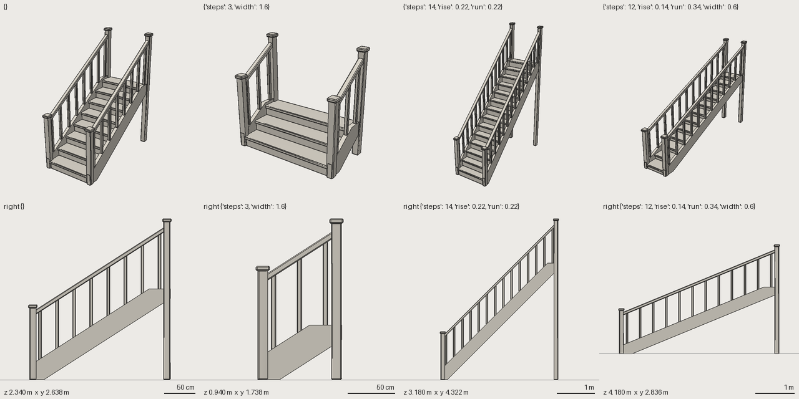

# FRESH_AGENT_02: relationship-heavy asset (staircase)

- **Date:** 2026-09-29 · **Repository state:** commit `ca25fa0` (Phase 5 research + plan)
- **Isolation:** fresh clone; `docs/experiments/` and `docs/research/` were **removed from the clone** so
  predictions and earlier results could not coach the agent. All product docs stayed.
- **Agent:** new coding agent, no project context (same model family as the authors)
- **Plan and predictions (written before the run):** [FRESH_AGENT_02_PLAN.md](FRESH_AGENT_02_PLAN.md)
- **Artifacts:** `assets/wooden_staircase` (+ `_short_wide`, `_steep_narrow`, `_long_shallow` variants)

*Rendered by the experimenters under settings the agent never tried: default; 3 steps/1.6 m wide; 14
steps/0.22 rise/0.22 run; 12 steps/0.14 rise/0.34 run/0.6 m wide. No source edits.*

## Observed (verified against files and by re-running)

| Metric | Value |
|---|---|
| Wall clock / tool calls / tokens | ~11 min (677 s) / 49 / ~149k |
| Human interventions | 0 (one permission denial for writing outside the repo; not needed) |
| Edit/review iterations / snapshots | 3 cycles after the first build (+ source-fix cycles) / 3 |
| Framework modifications | **none** (`git status`: only new asset folders) |
| Escape hatches (`mesh_file`, framework code) | none |
| Final | PASS, 1,632/3,000 tris, 44 parts, 2 materials, UV overlap 0, exported, `uv.lock.yaml` |

### Static analysis (`tools/experiments/analyze_source.py`)

| | staircase (FA-02) | anvil (FA-01) | tavern_chair (authors) |
|---|---|---|---|
| **Parameterization ratio** | **0.87** | 0.68 | 0.83 |
| literal / derived / measured spatial numbers | 12 / 61 / 17 | 25 / 54 / 0 | 10 / 41 / 9 |
| params (derived) | 31 (12) | 27 (0) | 22 (6) |
| `measure` queries | **10** (gap, bounds, ray) | 0 | 7 |
| attach / arrays / mirrors / components / `enabled` | 2 / 3 / 8 / 0 / 0 | 8 / 1 / 0 / 0 / 0 | 0 / 1 / 3 / 0 / 2 |
| family variants via `interface` | **3** (`sw family` PASS) | 0 | 1 |

**Abstraction escape profile (parts):** measured 7, attached 2, literal 1 (the stringer: a profile of
derived points, whose one literal is a corner), composed 0, mesh 0, framework 0.

### Robustness (`tools/experiments/perturb.py`, settings chosen by the experimenters)

| Setting | Result |
|---|---|
| steps 3 · steps 14 · steps 6/rise .22/run .22 · width 0.6 · width 1.6/steps 10 · rise .14/run .34/steps 12 · rail 1.0/steps 5 | **7/7 no errors** (warnings only: `UV_LOCK_STALE`, see findings) |
| steps 20 (outside declared range) | FAIL `BUDGET_TRIANGLES` (3,360 > 3,000), correctly caught |
| rise 0.3 (outside range) | the agent's own comfort check fires (`2·rise + run`) |

Visually verified: at every setting the rail follows the slope, balusters span stringer to rail, and
posts stand on the ground.

## Predictions vs outcome

| # | Prediction | Outcome |
|---|---|---|
| P1 | treads via `array` with count = steps | ✔ |
| P2 | posts by hand-arithmetic on the index (no index var) | ✘: balusters are an array whose height comes from **two `ray` queries** (down to the stringer, up to the rail) |
| P3 | slope via `atan2` arithmetic, no `measure` | ✘: the rail **spans measured newel centres**; its pitch is the **measured difference of post-top heights** (shear) |
| P4 | saw-tooth stringer not expressible | not hit: the agent chose a closed (housed) stringer, a legitimate design that avoids it. The capability gap remains. |
| P5 | no quick override tool; variants via edits or extends | ✔: used `extends` + `interface` + `sw family` (correct but heavier) |
| P6 | ratio 0.6–0.8 | ✘: 0.87 |
| P7 | no framework change | ✔ |

The agent found `measure` through AGENTS.md ("Don't re-derive another part's geometry with arithmetic")
and RELATIONSHIPS.md. **Discovery succeeded** where FA-01 did not need it.

## Friction and failure classification

| Report | Class | Action |
|---|---|---|
| A baluster whose foot floated (touching only the rail) passed validation; found only visually | **ABSTRACTION FAILURE (validation)**: connectivity is "touches something", not "is supported" | open: needs a support/load-path notion or relation checks in `checks:`; recorded for the validation roadmap |
| Checks could not name the last array instance when the count is a param | API ERGONOMICS | **fixed**: `part.first`, `part.last`, `part.count` in checks |
| No quick way to test other param values (wrote variant files) | API ERGONOMICS | **fixed**: `--set k=v` on validate/review/render/stats |
| `--part a,b,c` not accepted | API ERGONOMICS | **fixed**: comma-separated or repeated |
| Sockets could not use `attach.to: origin` | API ERGONOMICS (inconsistency) | **fixed** |
| Wanted a `tilt`/pitch query; used shear from measured heights | ABSTRACTION gap, worked around cleanly | deferred: workaround is semantic (measured), not arithmetic |
| bbox-based checks on chamfered, sheared parts are biased by the chamfer | ABSTRACTION (checks see bboxes) | open; `measure`-style queries inside checks would fix it |
| Unquoted commas inside flow-mapping strings split YAML | known YAML trap (DESIGN_REVIEW §2) | documented; no further change |
| **UV lock goes stale whenever `steps` changes** (instance names change) | **ARCHITECTURE finding for Phase 7**: locks are keyed by instance, but parametric arrays change instance sets | input to the texture-lifecycle design |

## Phase 5 gate

| Criterion | Verdict | Evidence |
|---|---|---|
| 1. fresh agent creates the relationship-heavy benchmark | **PASS** | exported, validated, 0 interventions |
| 2. parameter changes need no manual coordinate repair | **PASS** | 7/7 independent settings valid; renders correct |
| 3. relationships represented semantically/parametrically | **PASS** | ratio 0.87; 10 queries; 7 of 10 part definitions measured |
| 4. no unnecessary framework modification | **PASS** | none |
| 5. findings documented | **PASS** | this file |

**Remaining weaknesses:** (1) validation can't tell "supported" from "touching"; (2) checks reason over
bounding boxes, not queries; (3) no generated lists (saw-tooth stringers, per-index variation beyond
queries); (4) UV locks don't survive count changes; (5) n = 1 run, same model family.
