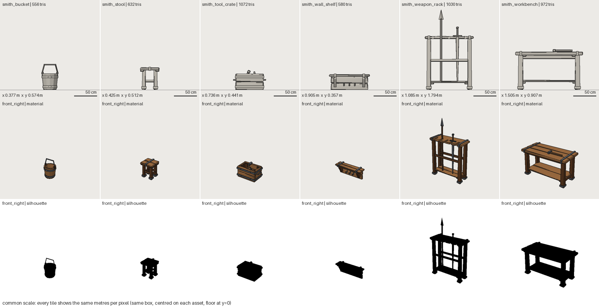

# FRESH_AGENT_03: coherent multi-asset pack (blacksmith workstation)

- **Date:** 2026-09-29 · **Repository state:** commit `6c98d0b` (after Phase 5)
- **Isolation:** fresh clone; `docs/experiments/` and `docs/research/` removed from the clone
- **Agent:** new coding agent, no project context (same model family as the authors)
- **Plan and predictions:** [FRESH_AGENT_03_PLAN.md](FRESH_AGENT_03_PLAN.md)
- **Artifacts:** `assets/smith_{workbench,stool,weapon_rack,wall_shelf,tool_crate,bucket}`,
  `components/{leg_frame,iron_band,smith_hammer}.yaml`, `packs/blacksmith.yaml` (migrated, see below)

## Observed (verified)

| Metric | Value |
|---|---|
| Wall clock / tool calls / tokens | ~23 min (1,380 s) / 120 / ~272k |
| Human interventions | 0 |
| Snapshots | 10 across six assets |
| Result | 5 PASS + 1 WARN (tool crate: accepted `UV_TEXEL_DENSITY` 1.53× vs 1.5×), all exported; 556–1,072 tris (limit 1,200) |
| **Framework modifications** | **3**: (1) a real bug fix, nested `translate` was discarded; (2) a new `sw pack` command + `pack.py` + 4 tests; (3) `sw family` accepting a parts-less base (to support its "kit" workaround) |

### Reuse (tools/experiments/analyze_pack.py)

| | |
|---|---|
| Components created / used | 3 new (`leg_frame`, `iron_band`, `smith_hammer`) + existing `plank_top` |
| Component reuse (assets using it) | `plank_top` 5 (11 instances), `iron_band` 5 (9 instances), `leg_frame` 3, `smith_hammer` 2 |
| Exact duplicate part definitions across assets | **0** |
| Structural duplicates (same generator + op chain in more than 2 assets) | `chamfer_box` ×4, `tube` ×3 (small details: pegs, handles) |
| Material drift across the pack | **0** (one definition per material, shared through the kit) |
| Detail density spread (tris/m²) | 3.95× (129 on the workbench to 511 on the bucket: round shapes vs large flat tops) |
| Texel density spread | 2.5× (one 512 px atlas per asset) |
| Parameterization ratio per asset | 0.60–0.79; `measure` used in 1 of 6 (bucket) |

## Predictions vs outcome

| # | Prediction | Outcome |
|---|---|---|
| Q1 | 1–3 components, reused | ✔ 3 new + 1 existing, heavily reused |
| Q2 | materials copied into every asset, may drift | ✘ no drift, but only because the agent **invented a workaround** (a parts-less `extends` "kit") |
| Q3 | shared dimensions repeated as literals | ✘ same workaround: kit params |
| Q4 | wants to mirror/array a component instance, hits the error | ✔ crate walls and bands duplicated as separate instances |
| Q5 | pack-wide inspection ad hoc | ✔ **and the agent built the missing tool itself** (`sw pack`) |
| Q6 | `extends` used little | ✘ used by every asset, but as set membership, not as family |
| Q7 | no framework modification | ✘ three |

## Failure classification and action

| Finding | Class | Action |
|---|---|---|
| Nested `translate` silently discarded | **framework BUG** (ours, since the hardening phase) | adopted the agent's fix + regression tests |
| No pack-level review | CAPABILITY (tooling) | adopted `sw pack` after review; added `--pack NAME` selection |
| No way to share scale/palette across a set; `extends` abused as a "kit" | **ABSTRACTION FAILURE** (concept collapse: inheritance vs membership) | new first-class **pack** (`packs/NAME.yaml`, `pack: NAME`, read-only params/materials, `PACK_OVERRIDE`); kit migrated; `sw family` hack removed. Geometry of all six assets unchanged (golden = agent's build) |
| Component instances can't be mirrored/arrayed | CAPABILITY | **fixed**: group replication through the same code path as parts |
| Components can't nest; instances can't take `measure` | CAPABILITY | recorded (not needed for the gate; revisit with evidence) |
| YAML `{doc: a, b: c}` silently splits (3rd occurrence across experiments) | API ERGONOMICS (format) | unknown-key errors now explain the trap |
| Texel density can't be matched across a pack (one atlas per asset) | ARCHITECTURE (surface) | **input to Phase 7** (texture budgets per pack) |
| UV texel warnings on thin rings/tubes that `seams: regions` can't fix | ARCHITECTURE (UV packing) | input to Phase 7 |
| Group `rotate` only X→Y→Z | API ERGONOMICS | recorded |
| Wall shelf authored as a floor asset (sits on y=0) | production metadata | input to Phase 12 (origin/placement policies) |

## Phase 6 gate

| Criterion | Verdict | Evidence |
|---|---|---|
| multiple assets produced coherently | **PASS** | pack sheet at one scale, one palette, same plank/leg/band language; 0 drift |
| useful structural reuse | **PASS** | 4 components; 0 exact duplicate parts |
| variants don't depend on private internals | **PASS after fix** | the kit workaround had no interface (`FAMILY_NO_INTERFACE`); packs replace it, and families keep `interface` |
| component contracts remain valid | **PASS** | all instances build; `COMPONENT_PRIVATE` never triggered |
| pack validates and exports | **PASS** | 5 PASS + 1 WARN (accepted, documented), 6 GLBs |
| reuse without an abstraction maze | **PASS, with a caveat** | 4 components with 3–8 public params each; one duplicated recipe because components cannot nest |

**Caveats:** (1) the agent modified the framework three times. One change was a genuine bug fix, and
none are needed after this phase's fixes, but a high framework-modification rate is exactly what the
program's success condition warns against, so it will be tracked in every later experiment.
(2) Pack **discoverability** (the new `pack:` concept) has not been tested by a fresh agent yet. The
next multi-asset experiment must check it. (3) n = 1, same model family.
