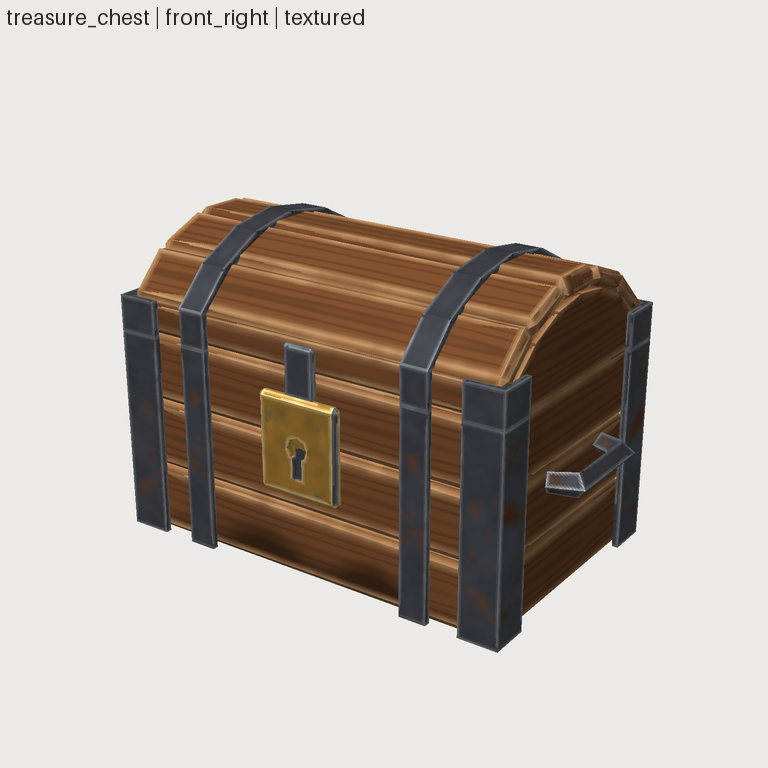

# FRESH_AGENT_04: textured asset, request to GLB (treasure chest)

- **Date:** 2026-09-29 · **Repository state:** commit `7c3c638` (Phase 8 implemented)
- **Isolation:** fresh clone; `docs/experiments/` and `docs/research/` removed; node gltf-validator installed
- **Agent:** new coding agent, no project context (same model family as the authors)
- **Plan and predictions:** [FRESH_AGENT_04_PLAN.md](FRESH_AGENT_04_PLAN.md)
- **Artifacts:** `assets/treasure_chest/` (source, `uv.lock.yaml`, `history/001–005`, `export/`)

## Observed (verified from artifacts)

| Metric | Value |
|---|---|
| Wall clock / tool calls / tokens | ~17 min (1,013 s) / 66 / ~188k |
| Human interventions | 0 (and no human material editing) |
| Snapshots | 5 (blockout → budget fix → wear/stains/shared UVs → round-trip fix → pivot/contact fix) |
| Result | PASS on every layer; 1,464 / 1,500 tris; 44 parts; 3 materials |
| Texture | one 1024² set (base colour + ORM), 339.8 px/m area-average (target 300), lifecycle all `DERIVED` |
| Export | Khronos 0 errors / 0 warnings / 0 infos / 0 hints; re-export byte-identical (`7610ac11…`) |
| Surface escape profile | 0 image files, 0 image layers, 0 flat materials: all detail from `wood` + `metal` ×2 archetypes |
| Material params set | oak 10, iron 10, brass 10 (tools/experiments/analyze_surface.py) |
| Parameterization ratio | 0.85 (25 params, no `measure`, no components; the task did not need them) |
| Texture views used | review contact sheet, `--mode textured` at 5 views and 3 sizes (128/160 px thumbnail checks), `sw materials`, `--mode seams`, textured UV view |
| **Framework modifications** | **1**: a genuine bug fix in `backend.load_scene_summary` + a regression test |

### Critique → revision (from the agent's snapshots)

The critiques named parameters, for example "iron edge wear reads as uniform bright outlines →
`edge_wear` 0.8 → 0.6, `edge_width` 0.008 → 0.007 so the break-up shows"; "wood looks too new →
`knots` 0.5 → 1.0, darker `color`"; "UV space wasted on duplicated iron → `share_instances`" (texel
density 308 → 339 px/m). The texture critique was done at thumbnail size, as the request asked.

## Predictions vs outcome

| # | Prediction | Outcome |
|---|---|---|
| T1 | finds archetypes within ~10 calls, uses wood + metal | ✔ `sw caps` → `sw doc wood/metal/...` were its first commands; wood + metal (brass as metal with verdigris "rust") |
| T2 | no hand-made images | ✔ none |
| T3 | handles `TEX_DENSITY_BELOW_TARGET` by lowering `texel_density` or raising the budget | ✔ both: `texture_size` 1024 (the prompt allowed it), target 512 → 300 |
| T4 | grain direction wrong on some part | ✘ not observed, but only because it **read `materials.py`** to learn that grain follows each part's long axis and structured the chest as one part per board. The behaviour was undocumented (DISCOVERY) |
| T5 | critiques name params | ✔ |
| T6 | wants per-plank variation | ✔ got it from the automatic per-part seed; noted that shared-UV instances can't vary (inherent) |
| T7 | skips `sw uv lock` | ✘ locked three times |
| T8 | Khronos-clean, within budget | ✔ |
| T9 | 0–1 framework modifications | ✔ 1 (bug fix) |

## Failure classification and action

| Finding | Class | Action |
|---|---|---|
| Export round-trip reported a multi-material part as missing (trimesh splits one glTF node with 2 primitives into generated child nodes). The GLB was valid; the checker was wrong | **framework BUG** (ours, Phase 8 made multi-material parts common) | adopted the agent's fix; regression test verified to fail without it |
| "Well used" had no control; the agent misused `knots` as stains | **ABSTRACTION** (missing semantic param) | new common params `grime`, `grime_color`, `grime_height`: dirt near the asset's base and in creases within a part, rough and non-metallic, noise broken up ([image](../images/treasure_chest_grime.png)). Creases *between* parts need an AO bake: recorded |
| Grain axis per part only discoverable by reading code | **DISCOVERY** | documented in ASSET_FORMAT ("patterns are evaluated per part…") |
| `PBR_METAL_TOO_DARK` hit twice while aiming for "dark iron"; the hint said "≥ ~110" but the check is < 90 | **API ERGONOMICS** (hint contradicted the rule) | hint now states the real threshold and a dark-iron example |
| A new asset fails the golden test until `update_golden.py` is run; AGENTS.md didn't say so | **DISCOVERY** | test message says what to run; AGENTS.md rule added |
| Image layers only blend by opacity (no multiply for grime) | CAPABILITY | recorded (grime covers the evidenced need) |
| ~8 MB uncompressed texture memory, no compression option | CAPABILITY (production) | input to Phase 12 (KTX2/Basis) |
| Pivot must be an anchor of the part itself: a lid hinge needed restructuring | CAPABILITY (production) | input to Phase 12 (pivots/origins) |
| Renderer is not PBR-accurate, so "dark iron" can't be judged exactly | known limit | recorded (renderer seam in SURFACES.md) |

After the fixes the agent's chest is a benchmark asset. Its geometry hash and GLB binary chunk are
unchanged; the GLB JSON gains the new `grime` defaults in the recipe extras.

## Phase 8 gate

| Criterion | Verdict | Evidence |
|---|---|---|
| request → geometry → UV → material → texture | **PASS** | archetypes found from the repository, UVs locked, 1024² bake |
| render → critique → revise on textures | **PASS** | 5 snapshots; critiques name material params; thumbnail-size checks |
| validation | **PASS** | all layers PASS, including `TEX_*`/`PBR_*` |
| export | **PASS** | Khronos 0/0/0/0, byte-deterministic |
| no human material editing | **PASS** | 0 interventions |

**Caveats:** (1) the agent read framework source to learn the grain model; that is now documented.
(2) One framework modification, a genuine bug fix (FA-03 had three). (3) n = 1, same model family;
Phase 13 tests other agents.
