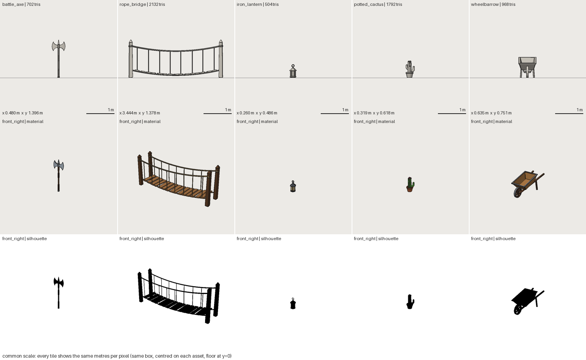

# FRESH_AGENT_05: modelling-breadth matrix (Phase 9)

- **Date:** 2026-09-29 · **Repository state:** commit `a957857` (after Phase 8)
- **Isolation:** four fresh clones (runs A–D); `docs/experiments/` and `docs/research/` removed; node gltf-validator installed
- **Agents:** four new coding agents, no project context, run in parallel (same model family as the authors)
- **Plan and predictions:** [FRESH_AGENT_05_PLAN.md](FRESH_AGENT_05_PLAN.md)
- **Artifacts:** 17 assets in `assets/` (listed below) and `components/fantasy_mushroom.yaml`. All are now benchmarks.

## Observed (verified from artifacts)

| Run | Assets (tris / budget, final status) | Time / tool calls / tokens | Framework changes |
|---|---|---|---|
| A hard-surface | fantasy_longsword 588/800 PASS · gearbox 1,762/2,500 WARN · scifi_wall_panel 972/1,500 PASS · fire_hydrant 894/1,200 PASS | 10 min / 55 / 149k | 0 |
| B architectural | stone_doorway 696/2,000 PASS · roof_section 1,640/3,000 WARN · timber_wall 646/1,500 PASS · pipe_assembly 2,444/3,000 PASS | 24 min / 69 / 191k | 0 |
| C curved/organic | ceramic_vase 708/1,200 PASS · drinking_horn 484/1,000 PASS · tree_stump 910/2,000 WARN · mushroom_cluster 1,244/1,500 WARN · potted_plant 816/2,000 WARN | 29 min / 131 / 257k | 1 (bug fix) |
| D mechanical | hand_cart 2,220/2,500 WARN · mine_cart 2,008/3,000 WARN · wheel_axle 1,444/1,500 PASS · well_winch 1,392/2,000 WARN | 13 min / 49 / 150k | 0 |

- 17/17 assets validated with no errors and exported. The Khronos validator reported 0 errors and 0 warnings on every export.
- No asset used a baked or generated mesh file (`mesh_escape` 0 in all 17).
- 0 human interventions.
- Every WARN was one of two warning classes, both later traced to the framework (see below).
- Parameterization ratio ranged from 0.31 (mushroom_cluster, whose values are component arguments) to 0.95 (timber_wall), median 0.73. The low ones mark hand-tuned placements: the plant at 0.44, the pipes at 0.54.
- `measure` was used in 12 of 17 assets.

## Gap matrix (counted by asset; ≥ 3 of 17 = Phase 9 candidate)

| Gap | Assets | Count | Predicted? |
|---|---|---|---|
| Hand-computed curves (arcs, helices, spirals, elbows) | doorway, pipes, horn, sword wrap, winch rope, stump roots | 6 | ✔ G2 |
| **Texel target unreachable**, overridden by hand | doorway, roof, timber_wall, pipes, hand_cart, mine_cart, wheel_axle, well_winch, tree_stump | 9 | ✘ |
| Per-instance variation in arrays (offset rows, skip a slot, start angle, varying tilt/length, 2D) | roof, doorway, stump, plant, mushroom spots | 5 | ✔ G1 |
| Member between two points; world paths lost to recentring | hand_cart, well_winch, timber_wall, horn strap, stump roots | 5 | ✘ |
| Rotation about an anchor (bbox anchor of a rotated shape) | roof, mushrooms, plant, wheel_axle, mine_cart | 5 | ✘ |
| `GEO_PART_FRAGMENTED` false positive on intentional pieces | hydrant, roof, stump, mushrooms, plant | 5 | ✘ |
| `UV_TEXEL_DENSITY` on rings/tubes (the suggested `seams` fix had no effect) | gearbox, hand_cart, mine_cart, winch, stump (+FA-03) | 5 | ✘ |
| Chamfer on extrusions | sword, doorway, sci-fi panel | 3 | ✔ G4 |
| Wood grain direction | roof shingles, stump cut face (+FA-04) | 3 across experiments | — |
| Point/tangent on a path; `measure` on component instances | pipes, horn; mine_cart (+FA-03) | 2 each | — |
| Gear meshing, face-fixed taper, flat tube section | gearbox; hand_cart; horn | 1 each | — |
| Loft (G3), smooth blends (G5), open surfaces (G6) | — | 0 | ✘ not observed |

Discovery and ergonomics findings (not capability gaps):
- The radial array step rule was learned from source (2 assets).
- A subtract's `position` is the tool's centre *after* its ops (panel).
- `measure` accepts count-independent source-part names (roof).
- `part.size` is not available outside `checks`, and the error hinted at the wrong fix (gearbox).
- Two more real bugs: the texel-target metric ignored `uv.texel_density` (D), and boolean labels leaked (C, below).

## Predictions vs outcome

The low-poly vocabulary covered all 17 classes with no mesh escapes, so the structure of
the system held. The cost showed up as **hand arithmetic**:
- roughly 40 min of shingle-row maths on the roof;
- about 1 h of path and placement reasoning on the horn;
- sin/cos/atan2 braces on three assets.

Predictions G1, G2 and G4 held. G3 (loft), G5 (smooth blends) and G6 (open surfaces) did
not appear; the agents found low-poly substitutes and did not report missing them. Several
gaps were not predicted: placement by endpoints, rotation about an anchor, and the two
validator problems. G9 (framework changes clustered on G1/G2) was wrong: the only change
was a bug fix.

## Failure classification and action

| Finding | Class | Action |
|---|---|---|
| Boolean face labels leaked between inputs: after `as_original()` manifold3d's `face_id` is a coplanar-group id, not a triangle index | **framework BUG** (since hardening; masked by single-material inputs) | fixed with a cheaper mapping than the agent's (group → triangles, containment test only for mixed groups); the agent's test + a mixed-group test; the chest's lock plate and hand_cart's wheels were mislabelled and are corrected |
| Texel-density target metric showed the profile value, not `uv.texel_density` | framework BUG | fixed + test |
| Arcs/helices by hand | **ABSTRACTION** | point generators `arc` (spiral via `radius_end`, ramp via `rise`), `helix`, `line` in every point list; `tube.corner_radius` |
| Per-instance variation | **ABSTRACTION** | `array.each` (translate/rotate/scale with `i`, `n`, `rand()`), `skip`, `start`, nested arrays (`name_i_j`) |
| Endpoints, world paths | **ABSTRACTION** | `strut` shape; `origin: keep` |
| Anchored rotation | **ABSTRACTION** | `rotate_about: anchor` |
| Extrude chamfer | CAPABILITY | `extrude.chamfer` (convex outlines; a clear error otherwise) |
| Intentional pieces flagged | **VALIDATION** (false positive) | `GEO_PART_FRAGMENTED` is now info. The actual failure is reported at the cutting op as `GEO_CUT_SPLIT` |
| Ring/tube texel warnings | **ARCHITECTURE** (UV region sizing ignored chart packing) | regions sized by area ÷ chart fill; all six warnings gone. Six locked assets were re-locked (procedural textures are always DERIVED) |
| Texel target unreachable | API ERGONOMICS (+ Phase 12: trim/tiling textures for large architecture) | the hint now gives the achievable number to set |
| Grain direction | CAPABILITY | `wood.grain_axis` |
| Discovery items | DISCOVERY | `sw doc array/arc/helix/line/origin/rotate_about`, `sw caps` POINTS/PARTS rows, ASSET_FORMAT sections, AGENTS rule, `part.size` error hint |
| Path point/tangent, `measure` on components, gears, loft | below threshold | recorded, not built |

All goldens were unchanged by the additions: 37 assets, of which 26 exports changed only
through the UV layout. Tests: `tests/test_breadth.py` (10) plus the bug regressions.

## Gate run: held-out classes (FRESH_AGENT_05_GATE)

- **Commit:** `4886e7e` (with the Phase 9 additions). One fresh agent, same isolation.
- **Classes:** battle axe, rope-bridge section, hanging lantern, cactus in a pot, wheelbarrow. None was
  used to design the additions.
- **Cost:** ~20 min (1,172 s), 84 tool calls, ~198k tokens.

| Asset | Tris / budget | Status | New vocabulary used (from the source) | Hand trig |
|---|---|---|---|---|
| battle_axe | 702 / 1,000 | PASS | `helix` (grip wraps) | 0 |
| rope_bridge | 2,132 / 3,000 | PASS | `arc` ×6 (sagging ropes), `array.each` ×3 (irregular planks/ties with `rand`), `origin: keep` ×2 | 2 (plank slope `atan2`) |
| iron_lantern | 504 / 1,500 | WARN (4 materials > style's 3) | `arc` (ring handle) | 0 |
| potted_cactus | 1,792 / 2,000 | WARN (4 materials) | `arc` ×4 (curving arms), `array.each` ×3, `rotate_about` ×2, `corner_radius` | 0 |
| wheelbarrow | 968 / 2,500 | PASS | `strut` ×3 (handles, legs), `rotate_about` (tray on the handle slope), `arc` ×3 | 1 (tray tilt `atan2`) |

- Khronos 0 errors on all five; the re-import check passed; 0 mesh files; no new shapes or ops.
- **Framework modifications: 1.** `ASM_HIDDEN_PART` counted glass as hiding the candle inside it.
  This is a validation false positive, fixed by the agent with a regression test and adopted here.

### Predictions vs outcome

| # | Prediction | Outcome |
|---|---|---|
| H1 | generators/`each` used in ≥ 3 of 5 | ✔ 5 of 5 use at least one addition |
| H2 | `strut` / `origin: keep` for the wheelbarrow or bridge | ✔ both |
| H3 | hand trig in ≤ 1 asset | ✘ **2 of 5** (bridge, wheelbarrow), down from 6 of 17. What's left is slope-following: "orient this along that curve/slope" |
| H4 | rope sag as an `arc` or hand points | ✔ `arc`, but the radius and angles for a given span and sag were derived by hand |
| H5 | 0 framework changes | ✘ 1, a genuine validator false positive rather than a missing capability |

### Remaining gaps (recorded, not built in Phase 9)

| Gap | Evidence | Status |
|---|---|---|
| Sampling a point/tangent on a curve inside `each:` (planks on a sagging curve, fittings along a pipe, tip of a horn) | bridge + pipes, horn (probe) = 3 | **next candidate**: a `curve` declared once and sampled by `i` would remove the remaining trig |
| Arc from endpoints + sag (instead of a centre) | bridge, axe crescent | NEAR, same design as the above |
| Measures indexed by instance; measure order within a part is significant but not explained | cactus, wheelbarrow | ergonomics, recorded |
| `flat_bottom` at a world height | wheelbarrow | small, recorded |
| Renders ignore transparency (parts behind glass need `--isolate`) | lantern | renderer, recorded |
| Same YAML error printed once per array instance | bridge | **fixed** (issues deduplicated) |

## Phase 9 gate

| Criterion | Verdict | Evidence |
|---|---|---|
| diverse asset classes | **PASS** | 22 new classes across hard-surface, architectural, curved, organic, mechanical: all valid and exported (39 benchmarks in total) |
| without frequent framework changes | **PASS** | 2 framework changes across 22 assets and 5 agents, both genuine bug/false-positive fixes with tests. No capability had to be added by an agent |
| without one-off custom generators | **PASS** | no asset-specific shape, op or mesh file |
| highest useful abstraction | **PASS, with a caveat** | the held-out run adopted the Phase 9 vocabulary in 5 of 5 assets. Slope and curve following still needs hand trig in 2 of 5 |

**Caveats:**
1. Quality was judged by the agents and spot-checked in images, not by artists.
2. n = 1 model family (Phase 13 tests cross-agent).
3. Curve sampling is the clearest next vocabulary item. It is recorded rather than built, so
   that it is added when the next benchmark needs it.
