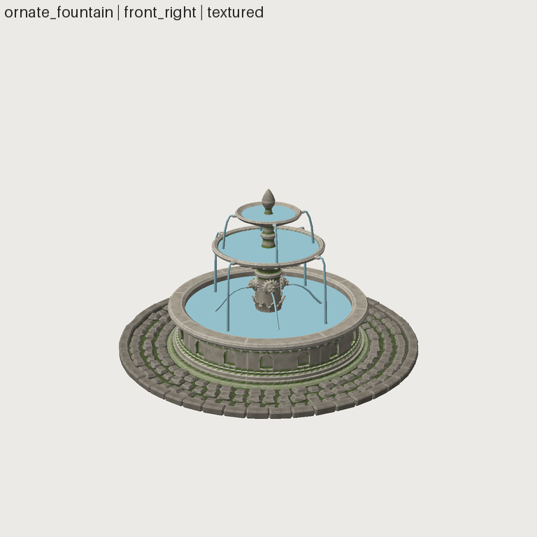

# FRESH_AGENT_06: a mid-poly asset in the agent loop (Phase 10 gate)

- **Date:** 2026-09-29 · **Repository state:** commit `145f272` (Phase 10 optimizations in)
- **Isolation:** as FA-02..05 · **Plan and predictions:** [FRESH_AGENT_06_PLAN.md](FRESH_AGENT_06_PLAN.md)
- **Artifact:** `assets/ornate_fountain/` (source, lock, `history/001–004`, export)

## Observed (verified from artifacts)

| Metric | Value |
|---|---|
| Wall clock / tool calls / tokens | ~26 min (1,581 s) / 70 / ~210k |
| Result | PASS on every layer; **43,928 tris** (25k–45k asked), 403 parts, 4 materials, one 2048² set at 319 px/m; Khronos 0 errors / 0 warnings; export re-verified byte-identical |
| Snapshots | 4 (FAIL → WARN → PASS → PASS) |
| Framework modifications | **0** |
| Limit errors | 0 `SRC_LIMIT`. Budget failures (55k, 47.5k, 45.2k) were the agent's own triangle target |
| Latency the agent saw | `sw review` 20–25 s, `sw export` ~29 s, `sw compare` 46 s, `sw snapshot` ~21 s, single renders 8–18 s |

The agent's words on speed: "acceptable; I batched several edits per review to save loops; I stopped
at 4 revisions partly for this reason."

## Predictions vs outcome

| # | Prediction | Outcome |
|---|---|---|
| M1 | 25k–45k tris, valid, exported | ✔ 43,928, PASS |
| M2 | review ≤ 15 s + ~10 s for a 2048 bake | ✔ at the edge: 24.3 s measured (15.2 s + 8.1 s bake + UV growth) |
| M3 | segments/subdivide/noise/arrays, no mesh file | ✔ lathe/revolve, radial arrays, subdivide, noise, decimate (lion masks); 0 mesh files |
| M4 | moss = green `grime` | ✔ exactly that, found by reading bake/materials code |
| M5 | no limit error on legitimate work | ✔ |
| M6 | 0 framework changes | ✔ |

## Findings and action

| Finding | Class | Action |
|---|---|---|
| Review 24 s on a 403-part asset. The synthetic benchmark (≤ 65 parts) missed a **per-pair** cost: the assembly validator recomputed part bounds ~165k times and converted meshes to solids 5,032 times | PERFORMANCE (scales with parts², not triangles) | bounds computed once plus a vectorized pair prefilter; solids converted once and reused. Assembly 7.1 → 2.0 s, review 24.3 → **20.8 s**, results identical |
| Export ran every validator twice | PERFORMANCE | `collect` once, report twice: export 26 → **20.5 s**; report and GLB byte-identical to the agent's |
| Remaining review cost: 2048² bake ~8 s (per-texel material noise), UV 5.4 s (24 unwraps), sheet 5 s | intrinsic at this size | documented; iterate at 1024, bake 2048 for the final export |
| 403 part nodes / 806 meshes: draw-call heavy | PRODUCTION | **Phase 12**: merge static parts per material at export (with an option to keep nodes) |
| No per-part texel priority (water and hidden faces get atlas space); the agent used shared-UV segments, so the stone pattern repeats 8× | CAPABILITY (surface) | recorded for Phase 12 texture budgets |
| Transparency not shown in renders (water) | renderer | recorded (2nd occurrence after the lantern) |
| Moss/grime behaviour learned from code | DISCOVERY (minor) | `sw doc stone` already lists `grime`, `grime_color` and `grime_height`. Recorded |

## Phase 10 gate

"Representative 50k-triangle assets should remain usable within reasonable cloud-agent workflows
without architectural instability."

| Criterion | Verdict | Evidence |
|---|---|---|
| usable at ~50k | **PASS** | synthetic 50k: 12–13 s per loop (both families); agent-built 44k/403-part asset: 20.8 s review, 20.5 s export after fixes; the agent completed 4 revisions and called speed acceptable |
| no architectural instability | **PASS** | no crashes, timeouts or memory problems (peak ≤ 540 MB at 50k); dense-boolean degeneracies fixed at the kernel; all speedups bit-identical |
| resource safety | **PASS** | every adversarial case rejected before the heavy work (< 1 s, < 100 MB) |
| measurements recorded, not invented | **PASS** | docs/PERFORMANCE.md + docs/perf/*.json; agent latencies from its report, spot-checked (review 24.3 s reproduced) |

**Caveat:** at 20+ s per review the agent rationed iterations. That's workable, but review latency
is now the main thing limiting iteration count on mid-poly assets. The largest remaining costs are
the 2048 bake and UV; a lower-resolution preview bake during iteration is the obvious next
lever, to be added if it is needed.
