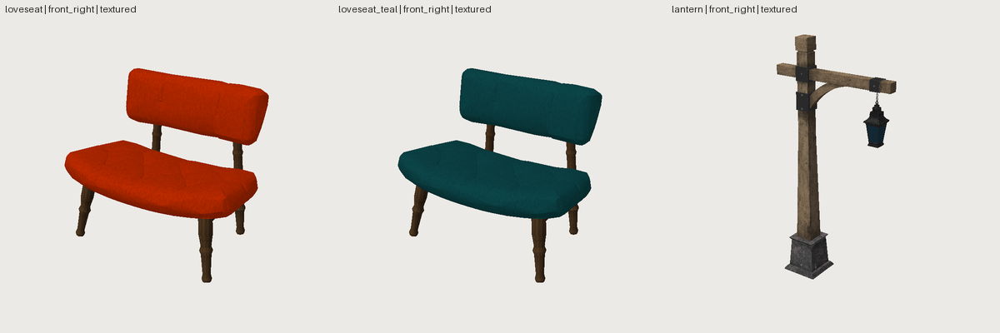

# FRESH_AGENT_07: import, modify and repair real assets (Phase 11 gate)

- **Date:** 2026-09-29 · **Repository state:** commit after `6ede37c` (Phase 11 implementation)
- **Inputs:** `SheenChair.glb` (Wayfair) and `Lantern.glb` (Microsoft), both CC0 1.0 Khronos glTF sample models
- **Plan:** [FRESH_AGENT_07_PLAN.md](FRESH_AGENT_07_PLAN.md) · predictions I1–I6 in [../IMPORT.md](../IMPORT.md)
- **Artifacts:** [fa07/](fa07/) (sources, UV locks, history). The ~50 MB of third-party binaries are
  regenerated by `tools/experiments/fetch_fa07.py`, and all three assets then validate.

## Observed (verified from artifacts)

| Metric | Value |
|---|---|
| Wall clock / tool calls / tokens | ~19 min (1,141 s) / 88 / ~208k |
| Requested changes done | **7 / 7** |
| **Framework modifications** | **0** (the gate) |
| loveseat | 39,936 → **7,904 tris** (≤ 8,000); 16 named parts; velvet and wood keep their file textures, plus native turned-wood legs baked in an atlas; 16 UCX boxes; WARN, 0 errors |
| loveseat_teal | `extends` variant; velvet colour factor changed over the grey fabric texture; WARN, 0 errors |
| lantern | 25.7 → **2.50 m**; repaired; post ×1.2; 5,394 → 4,608 tris; one authored 2048² set (4 maps); WARN, 0 errors (PASS after this phase's `clean` fix) |
| Khronos | 0 errors on all three |

**Independent texture-fidelity check.** Every exported velvet and wood face was sampled the way an
engine does (glTF v-down) and compared with the original file's texture at the nearest original
face. After 5× decimation the mean colour difference is **0.033 (velvet) and 0.061 (wood)**. As a
control, sampling the exported wood with v flipped gives 0.077. The texture mapping survived import,
repair, decimation and export.

## Predictions vs outcome

| # | Prediction | Outcome |
|---|---|---|
| I1 | textures survive the round trip, Khronos-clean | ✔ (checked independently, above) |
| I2 | renames pieces from renders, uses `--split` to address sub-parts | ✔ `--split` probes, then `node` + `piece` addressing with meaningful names |
| I3 | decimation keeps the mapping | ✔ but two thin shells stalled far above the target (see findings) |
| I4 | replacing a part: delete the imported piece, add a native one | ✔ lathe legs placed along the originals' measured axes, with `rotate_about: anchor` |
| I5 | surprise at the baked vs pass-through mix | ✘ not raised; the agent read IMPORT.md and planned for it |
| I6 | 0 framework changes | ✔ |

## Findings and action

| Finding | Class | Action |
|---|---|---|
| `sw compare 1 current` failed on imported assets (history rebuilt from `.build/`, so relative `source/` paths broke) | **BUG** | rebuilds from the asset folder; test |
| A variant could not use its base's `mesh_file` or textures; the agent copied 7 MB | **ABSTRACTION** (family + files) | variants search their own folder, then the `extends` chain's folders (sandboxed per root); test. The artifact variant now has no copies |
| A part named like the asset broke the export round trip, and the error didn't say why | BUG | the root node becomes `<asset>_root` only on a clash; test |
| `clean fill_holes` re-created degenerate faces; the agent's workaround left open edges | **BUG** (repair) | `clean` now **collapses** needles instead of deleting them, before and after filling. The lantern head repairs to a closed, UV-keeping shell, and the asset is now PASS |
| `decimate` stalled at ~1,250 of 3,072 tris on a closed shell, silently | CAPABILITY (fast-simplification) | reproduced; `OP_DECIMATE_LIMITED` / `OP_DECIMATE_OPENED` warnings. The agent's "stepwise decimation fixes pinching" did **not** reproduce, so no stepping was built |
| No scale hint for a 25.7 m prop (threshold 50 m) | ERGONOMICS | threshold 10 m, with a suggested factor for 2.5 m |
| Normal-mapped exports without tangents (`EXP_GLTF_..._GENERATED_TANGENT_SPACE`) | PRODUCTION | Phase 12 (tangents) |
| Collision is all-or-nothing (per-part boxes or hulls); no single hull or hand-placed boxes | PRODUCTION | Phase 12 |
| `measure` cannot query a deleted/replaced imported part (leg axes measured in Python) | ABSTRACTION (minor) | recorded |
| The brief called the legs "metal"; the file's legs are wood with metal glides | prompt error (ours) | noted. The agent inspected, reported it and chose sensibly |

## Phase 11 gate

"A fresh agent can import and meaningfully modify an external game asset without requiring
framework-level code changes."

| Criterion | Verdict | Evidence |
|---|---|---|
| import real external assets | **PASS** | two production CC0 assets (4 materials, KHR extensions, 2048² PBR set, wrong units, degenerate faces) |
| meaningful modification | **PASS** | 7/7: semantics, 5× reduction with textures intact, part replacement with native geometry, collision, material variant, rescale, proportion change, repair |
| no framework changes | **PASS** | 0 |
| baked vs native vs imported kept distinct | **PASS** | authored parts pass through; native legs bake; procedural intent is not claimed for imported pieces |

**Caveats:**
1. The agent read framework code to settle details (the path sandbox, the `clean` implementation).
2. Five framework issues it hit are fixed after the gate. None was needed to finish, but each cost
   it time.
3. n = 1.
