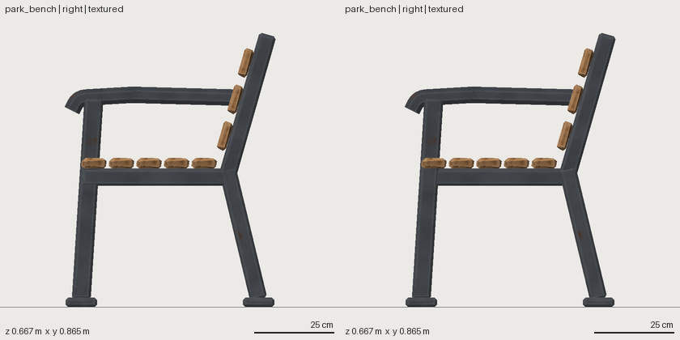

# Seams: where parts meet

A model made of parts has seams. Every other layer can pass while a seam is wrong: two faces in the same place
**flicker** in an engine (z-fighting), a sign that only touches a wall shows a **hairline gap**, and jitter can turn a
thin plank **inside out**. The `seams` validator and two related checks catch these.

| code | severity | what it means | fix |
|---|---|---|---|
| `SEAM_COPLANAR_OVERLAP` | warning | two parts share ≥ 0.5 cm² of the same surface, facing the same way, within 1 mm. The message says where (`near (x, y, z), facing +x`) | offset one face by a few mm (**depth ranks**), end one part inside the other, or make one slimmer |
| `ASM_CONTACT_ONLY` | info | a part only touches another face to face, without embedding: a hairline in renders | embed it 1–3 mm |
| `OP_FACES_INVERTED` | warning | an op (jitter, noise) turned faces inside out: the part is thinner than the op's amplitude | thicken the part or lower the amount |

What is **not** reported, because nobody can see it: overlap buried inside a third part (two plank ends inside a
beam), downward faces lying on the ground (the floor covers them), and back-to-back contact (a wall against a post).

## Try it

A wall with a plinth whose front face is flush with the wall's:

```yaml
# file: assets/doorway/asset.yaml
shapewright: 0.1
asset: {name: doorway, kind: prop/architecture}
materials: {stone: {base_color: "#9a948a"}}
parts:
  wall:   {shape: {type: box, size: [1.0, 1.2, 0.2]}, material: stone, anchor: bottom, position: [0, 0, 0]}
  plinth: {shape: {type: box, size: [0.3, 0.4, 0.2]}, material: stone, anchor: bottom_left, position: [-0.5, 0, 0]}
```

```bash
# run
sw validate doorway
```

It passes every other layer and warns `SEAM_COPLANAR_OVERLAP: wall and plinth share ... cm² of the same surface
facing the same way (near (...), facing front)`. Make the plinth 5 mm proud of the wall on every side it shares and the warning is gone:

```yaml
# file: assets/doorway/asset.yaml
shapewright: 0.1
asset: {name: doorway, kind: prop/architecture}
materials: {stone: {base_color: "#9a948a"}}
parts:
  wall:   {shape: {type: box, size: [1.0, 1.2, 0.2]}, material: stone, anchor: bottom, position: [0, 0, 0]}
  plinth: {shape: {type: box, size: [0.305, 0.4, 0.21]}, material: stone, anchor: bottom_left, position: [-0.505, 0, 0]}
```

```bash
# run
sw validate doorway
```

## The three recipes, as used on the example assets

Cleaning the 15 example assets that had seam pairs (78 pairs) took three recipes:
- **flush faces of two parts**: make one part a few mm slimmer or prouder (a bench's seat rail 12 mm thinner than its legs);
- **coincident ends**: end one part inside the other (a fountain bowl's segments meet 0.5 mm short of the axis instead of overlapping);
- **a fitting lying on a surface**: lift it or sink it 1–3 mm (hinge pins 3 mm past the knuckles).



*The bench before (left) and after (right): the change is invisible at a glance, the flicker is gone.*

In a modular kit, **depth ranks** keep seams clean by construction: every layer of a wall (posts, rails, braces,
plaster) sits at its own depth, a few mm apart. See the [modular kit](../use-cases/modular-kit.md) use case.
