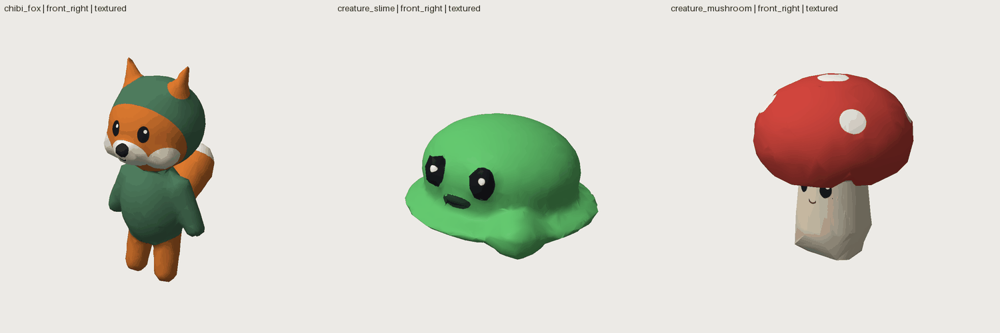
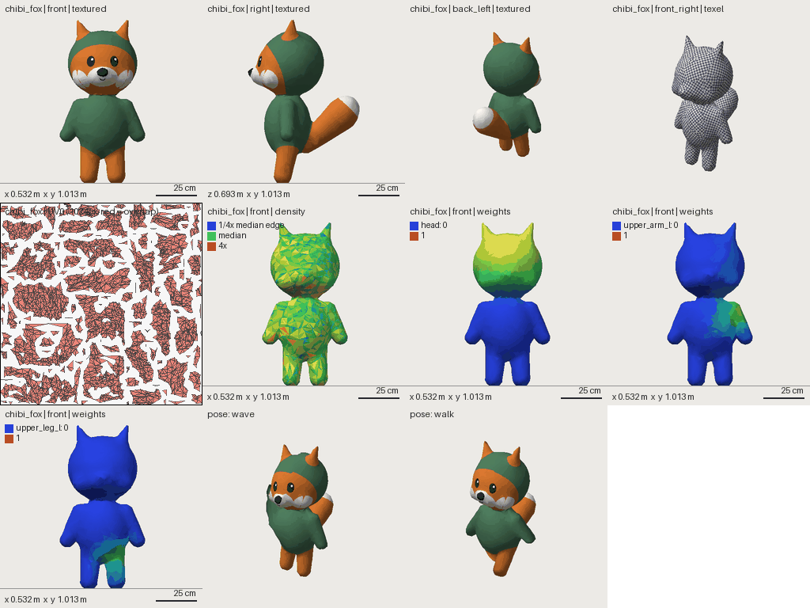
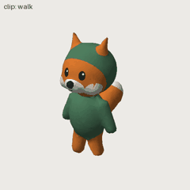

# Characters and creatures

Organic forms are built from signed-distance items blended into one closed mesh (`type: blend`), painted per
texel (regions and decals), rigged with a skeleton template and animated with procedural clips. Everything runs
inside Shapewright: no Blender, no external tools. The result is a skinned GLB that Godot imports with its
skeleton and clips.



**A small creature.** Items melt together in order; `op: subtract` carves; `mirror: x` makes pairs; each item's
`material` is painted where its own surface is. Decals add the face.

```yaml
# file: assets/blob/asset.yaml
shapewright: 0.1
asset: {name: blob, kind: character/creature, description: A round creature with ears and feet., placement: floor}
budget: {triangles: 3000}
materials:
  fur:   {base_color: '#d98a3a', roughness: 0.8}
  belly: {base_color: '#f2e6d0', roughness: 0.8}
parts:
  body:
    material: fur
    origin: keep
    shape:
      type: blend
      radius: 0.03
      triangles: 2500
      ground: true
      items:
        - {sdf: ellipsoid, center: [0, 0.3, 0], radii: [0.22, 0.26, 0.2]}
        - {sdf: ellipsoid, center: [0, 0.26, 0.1], radii: [0.15, 0.17, 0.12], material: belly}
        - {sdf: cone, a: [0.1, 0.5, 0], b: [0.14, 0.64, -0.02], radius_a: 0.06, radius_b: 0.015, mirror: x}
        - {sdf: capsule, a: [0.09, 0.1, 0], b: [0.09, 0.02, 0.04], radius: 0.06, mirror: x}
      decals:
        - {kind: eye, at: [0.07, 0.4, 0.19], toward: [0.3, 0, 1], size: 0.025, mirror: x}
        - {kind: smile, at: [0, 0.33, 0.21], size: 0.02, color: '#4a2a1a'}
```

```bash
# run
sw validate blob
sw render blob --mode textured --view front
```

**A skeleton.** Give the joints from the model's own coordinates (`_l` joints are mirrored to `_r`); the
weights are solved by bone heat, and the standard poses are checked for volume loss.

```yaml
# append: assets/blob/asset.yaml
rig:
  template: biped
  joints:
    hips: [0, 0.22, 0]
    spine: [0, 0.32, 0]
    neck: [0, 0.42, 0]
    head: [0, 0.48, 0]
    upper_arm_l: [0.16, 0.36, 0]
    lower_arm_l: [0.2, 0.3, 0]
    hand_l: [0.22, 0.25, 0]
    upper_leg_l: [0.09, 0.14, 0]
    lower_leg_l: [0.09, 0.08, 0.01]
    foot_l: [0.09, 0.03, 0.03]
```

```bash
# run
sw validate blob
sw export blob
```

The export carries the skin (`JOINTS_0` / `WEIGHTS_0`, inverse bind matrices) and three clips, `idle`, `walk`
and `wave`; tune them under `rig: {clips: {walk: {stride: 30, bounce: 0.015}}}`.

**Review a character.** `sw render NAME --character` puts the look, the reference image (`reference:
concept/x.png`), the UV checker and layout, triangle density, the weights of key joints and two poses on one
sheet; `--poses` shows the six standard poses, `--clip walk` a looping GIF, `--mode weights --bone head` one joint.
In the workbench, the 3D view has a skeleton overlay, a joint-weights view and a clip player with a pose slider.





What to expect: stylised and low-poly characters (chibi, creatures, mascots). Marching-cubes topology is even
triangles, not hand-made edge loops, so realistic characters that need clean deformation loops are out of scope.
