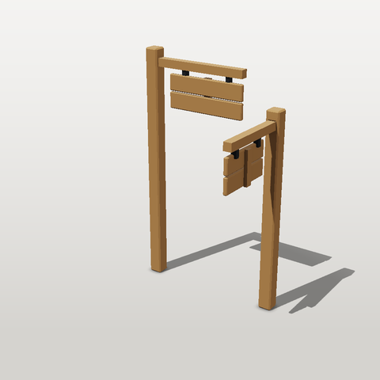

# Composition: components, nested components and asset instances

Four reuse levels, built up in one project: a **component**, a **component made of components**, an
**asset** that uses it (with `measure:` and a hinge), and an **asset made of assets**. Every block below runs as written.



## 1. A component

A component is a sub-assembly with public params and material *slots*. It is not an asset: it has no budget and
cannot be exported alone.

```yaml
# file: components/plank.yaml
shapewright: 0.1
component: plank
doc: One chamfered board. Material slot `wood`.
params:
  length: {value: 0.6}
  width:  {value: 0.12}
  t:      {value: 0.03}
parts:
  board:
    shape: {type: chamfer_box, size: [length, width, t], chamfer: 0.006}
    material: wood
```

## 2. A component made of components

`sign_board` places two `plank` instances and a batten. Nested parts are named `<instance>_<part>`
(`top_board`), and a sibling can attach to them (`attach: {to: top}`). Material slots map outward: the plank's
`wood` becomes the sign's `wood`.

```yaml
# file: components/sign_board.yaml
shapewright: 0.1
component: sign_board
doc: A sign of two planks on a back batten (a component made of components). Material slot `wood`.
params:
  length: {value: 0.6}
parts:
  top:    {component: plank, with: {length: length}, materials: {wood: wood}, position: [0, 0.065, 0]}
  bottom: {component: plank, with: {length: length}, materials: {wood: wood}, position: [0, -0.065, 0]}
  batten:
    shape: {type: box, size: [0.05, 0.25, 0.025]}
    anchor: front
    attach: {to: top, at: back, offset: [0, -0.065, 0]}
    material: wood
```

## 3. An asset that uses it, with `measure:` and a hinge

The sign is placed against the arm **as built** (`measure: {a: {bounds: arm}}`), so changing `height` or
`sign_length` moves it with no hand-derived numbers. `pivot: top` makes the whole sign one node hinged at its top
edge, ready to swing in an engine. The iron straps make sure it touches the arm: a sign 4 cm under the arm with
nothing holding it is `ASM_FLOATING_PARTS`, an error.

```yaml
# file: assets/signpost/asset.yaml
shapewright: 0.1
asset: {name: signpost, kind: prop/sign, description: A post with a hinged two-plank sign.}
budget: {triangles: 1500}
materials:
  oak:  {base_color: "#8a6a48", roughness: 0.85}
  iron: {base_color: "#4a4d52", roughness: 0.5, metallic: 1}
params:
  height: {value: 1.8, min: 1.2, max: 2.4}
  sign_length: {value: 0.6, min: 0.4, max: 0.9}
parts:
  post: {shape: {type: chamfer_box, size: [0.1, height, 0.1], chamfer: 0.01}, anchor: bottom, material: oak}
  arm:  {shape: {type: box, size: [sign_length + 0.1, 0.06, 0.06]}, anchor: left, position: [0.05, height - 0.1, 0], material: oak}
  sign:
    component: sign_board
    with: {length: sign_length}
    materials: {wood: oak}
    measure:
      a: {bounds: arm}
    anchor: top
    position: [a.center.x + 0.05, a.min.y - 0.04, 0]
    pivot: top
  hanger:
    doc: two iron straps from the arm down into the sign (the sign must not float)
    measure:
      a: {bounds: arm}
    shape: {type: box, size: [0.03, 0.075, 0.04]}
    anchor: top
    position: [a.center.x + 0.05 - 0.3 * sign_length, a.min.y + 0.01, 0]
    array: {count: 2, offset: [0.6 * sign_length, 0, 0]}
    material: iron
sockets:
  lamp: {attach: {to: arm, at: right}, doc: hang a lantern here}
```

```bash
# run
sw validate signpost
sw validate signpost --set height=2.2,sign_length=0.85
```

## 4. An asset made of assets

`asset:` places a whole asset. `with:` sets *its* params, so one source gives two different posts. Parts are
named `<instance>_<part>` (`east_sign_top_board`), and the signpost's `lamp` socket comes along as `north_lamp`
and `east_lamp`, turned with the instance.

```yaml
# file: assets/crossing/asset.yaml
shapewright: 0.1
asset: {name: crossing, kind: prop/sign, description: Two signposts at a crossing.}
budget: {triangles: 3000}
parts:
  north: {asset: signpost, position: [-0.5, 0, 0]}
  east:  {asset: signpost, with: {height: 1.5, sign_length: 0.45}, rotate: [0, -90, 0], position: [0.5, 0, 0]}
```

```bash
# run
sw validate crossing
sw stats crossing
sw render crossing --mode beauty --size 320
```

Guards you will meet: a `with:` key the asset does not have is `SRC_REF` (with a suggestion), a pack param in
`with:` is `PACK_OVERRIDE` (pack params are the same for every member), two assets with the same material name
but different definitions is `MATERIAL_CONFLICT` (map one with `materials:`), and nesting stops at 4 levels.
The full reference is the Composition section of
[ASSET_FORMAT.md](https://github.com/billtruong003/ShapeWright/blob/main/docs/ASSET_FORMAT.md).
