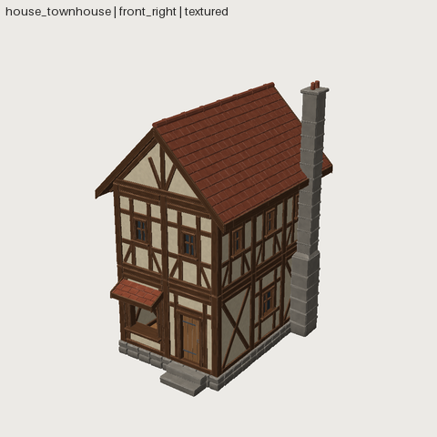

# A modular kit and buildings made from it

The flagship example is the **cozy_house** kit: 26 modules (walls, posts, floors, roof pieces, openings, chimney) and 3 demo houses. It was built as an acceptance test (MODULAR_HOUSE_PACK_01) and then rebuilt with Phase 19 composition.

<model-viewer src="../../gallery/models/house_townhouse.glb" camera-controls auto-rotate style="width:100%;height:360px;background:#ecebe7;border-radius:8px" alt="Townhouse"></model-viewer>

## The pattern

1. **A pack is the single source of truth.** `packs/cozy_house.yaml` holds the grid (`bay` 2 m), the storey height, the timber sections, the opening sizes, the roof pitch and the 7 shared materials. These are read-only in every member, so modules cannot drift apart.
2. **Components are the construction.** `house_wall` (plates, studs, braces, plaster with openings, depth ranks), `house_roof`, `house_timber`, …
3. **Module assets** are small assets made of 1–3 component instances. Each one exports as a GLB and is reviewed on its own.
4. **Buildings instance module assets** and place each one by its origin with grid arithmetic:

```yaml
# file: assets/shed/asset.yaml
shapewright: 0.1
pack: cozy_house
asset: {name: shed, kind: environment/building, description: A one-bay shed from cozy_house module assets.}
budget: {triangles: 12000, materials: 7}
params:
  y_wall: base_h - sink
parts:
  footing_fb: {asset: house_footing, position: [0, 0, bay / 2], array: {count: 2, offset: [0, 0, -bay]}}
  corner:     {asset: house_corner, position: [-bay / 2, 0, bay / 2], array: [{count: 2, offset: [bay, 0, 0]}, {count: 2, offset: [0, 0, -bay]}]}
  deck:       {asset: house_floor, position: [0, base_h - floor_t, 0]}
  front:      {asset: house_wall_door, position: [0, y_wall, bay / 2]}
  back:       {asset: house_wall_window, with: {shutters: 0}, rotate: [0, 180, 0], position: [0, y_wall, -bay / 2]}
  sides:      {asset: house_wall_plain, rotate: [0, 90, 0], position: [-bay / 2, y_wall, 0], array: {count: 2, offset: [bay, 0, 0]}}
```

```bash
# run
sw validate shed
```

## What keeps a kit honest

- **Grid rule, no hand offsets.** A post stands on every grid node, and a wall fills the span between two posts. Walls and posts start `sink` below the deck top, so they are always embedded and never touching exactly.
- **Measured placement.** Pieces that hang on other pieces use `measure:`. The shutters sit on the *measured* stud face, not on a typed depth.
- **Seams.** The `seams` validator flags coplanar same-facing overlaps between parts (z-fighting), which every other check passes. The first cottage had 6 visible ones.
- **Stress test.** Change `bay`, `storey`, `timber`, `post` and `pitch` in the pack and rebuild. All three houses re-flow with no edits.

Read the full record: [MODULAR_HOUSE_PACK_01](https://github.com/billtruong003/shapewright/blob/main/docs/experiments/MODULAR_HOUSE_PACK_01.md).
