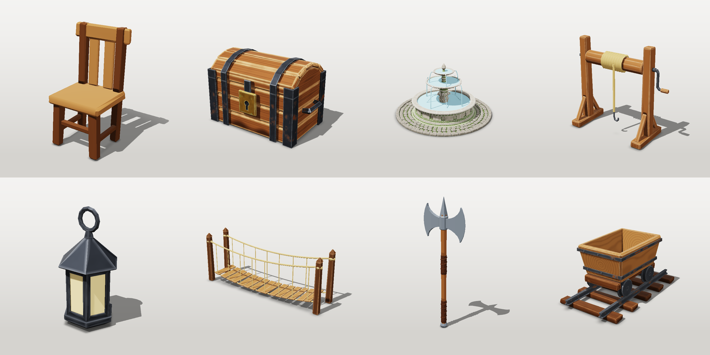
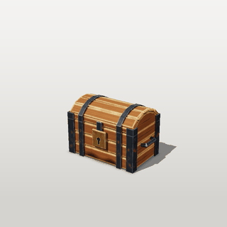
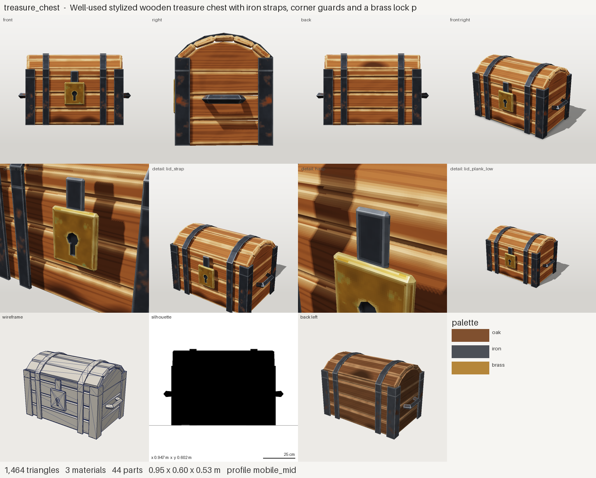
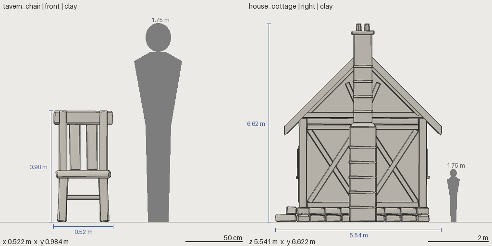
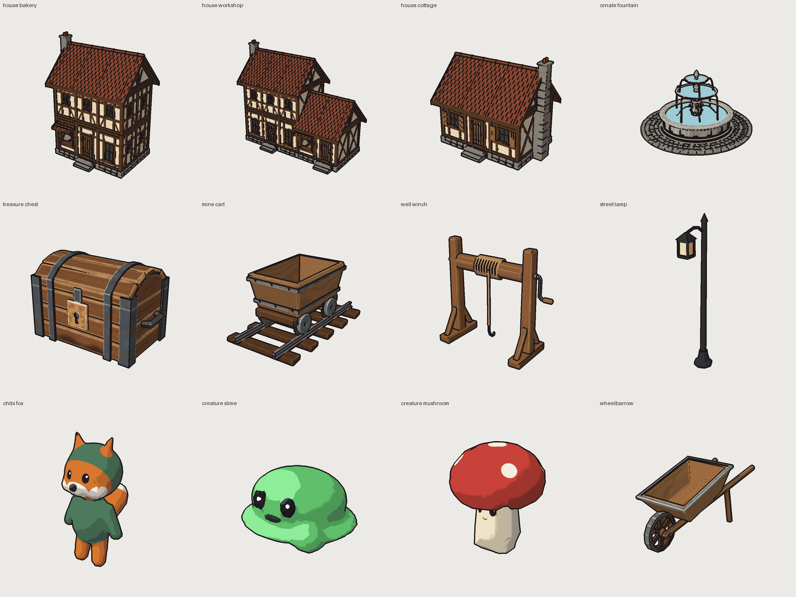

# Presentation renders

Inspection renders (`clay`, `parts`, `wire`, `textured`...) are built for checking an asset: flat light, outlines,
nothing hidden. When the asset is finished, `beauty` renders it for a README, a store page or a portfolio:
three-point light, shadows, ambient occlusion, a soft contact shadow on an invisible ground, tone mapping.
It runs on the CPU like everything else and gives the same bytes every time.



**One image.**

```bash
# run
sw render crate --mode beauty --size 384
```

**A turntable** (`renders/turntable.gif`; an `.mp4` too when `imageio-ffmpeg` is installed):

```bash
# run
sw render crate --turntable 12 --size 160
```



**A presentation sheet** (`renders/present.png`): front, side, back and 3/4 views, four detail close-ups (the
most detailed parts, or the ones you name with `--part`), wireframe, silhouette, the palette and the counts.

```bash
# run
sw render crate --present --size 512
```



**Scale reference.** In the orthographic side views (`front`, `back`, `left`, `right`), `--scale-ref` adds a
1.75 m figure and the asset's overall width and height:

```bash
# run
sw render crate --view front --mode clay --scale-ref
```



Agents get the same through MCP: `render(name, view="front_right", mode="beauty")`.

Beauty renders are for people. Keep reviewing with `sw review` (inspection modes): shadows and tone mapping
hide exactly the things a review looks for.

**Toon shading.** `toon` renders cel shading (three light bands and a highlight band) over the baked or material
colours, with outlines found on the rendered image: the silhouette, depth steps (one surface in front of another)
and creases. Because they are found per pixel, the outlines stay continuous at hard edges and split normals, where
an extruded-hull outline would tear.

```bash
# run
sw render crate --mode toon --size 320
```



The workbench's 3D view has the same look live ("toon + outline"): three.js toon materials and an inverted-hull
outline pushed along **smoothed** normals. Every vertex at one position moves along the same averaged normal, so the
hull stays closed at hard edges, and its back faces form one continuous silhouette around the form. It follows the
skeleton on rigged characters while a clip plays.
